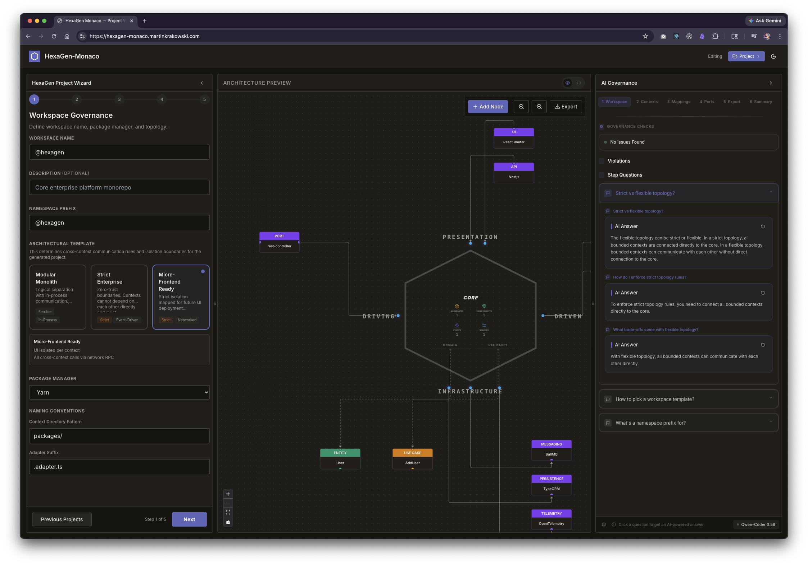
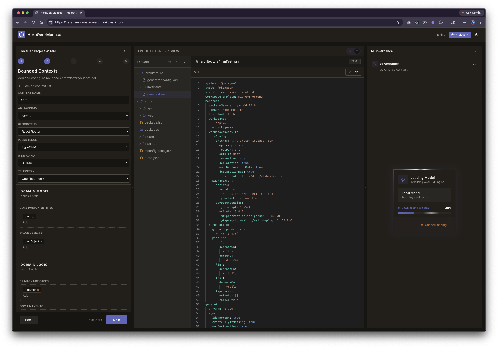
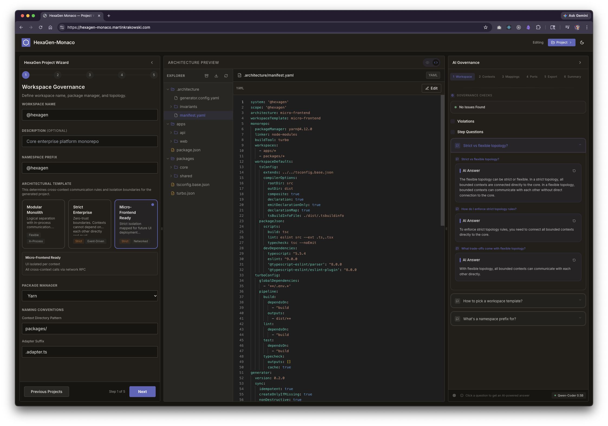
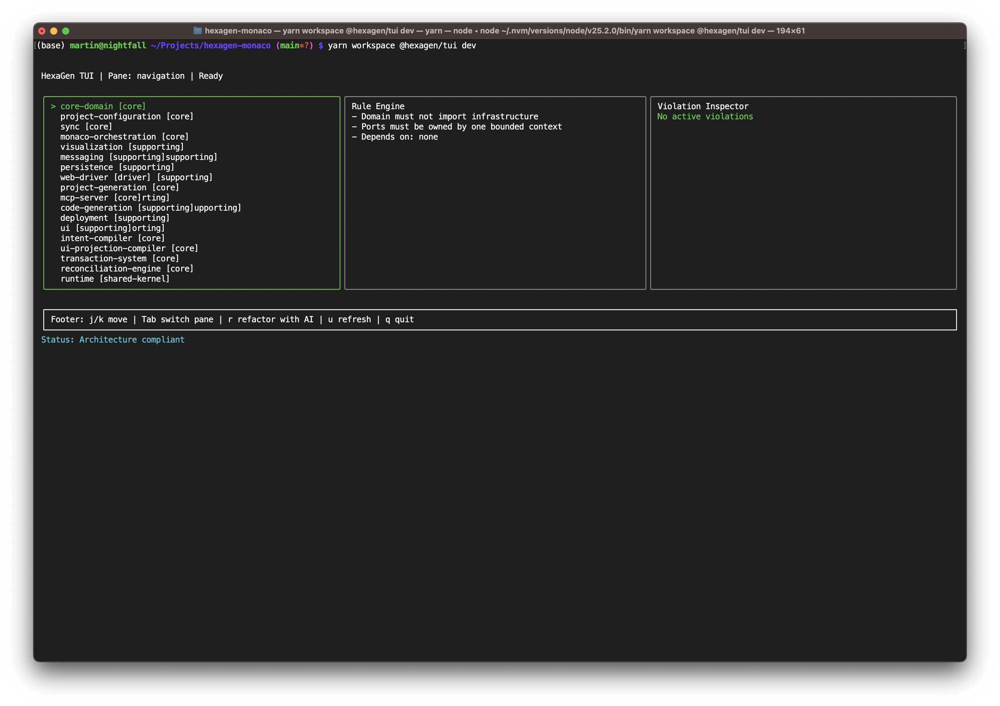

<p align="center"></p>

<div align="center">

# Hexagen-Monaco <br> Architecture Governance Engine

[](https://github.com/martinkrakowski/hexagen-monaco/actions/workflows/sync-integrity.yml)
[](https://opensource.org/licenses/MIT)

**Architecture should compile**

<a href="https://hexagen-monaco.cloud/">View application demo</a>

</div>

## The Problem

Architectural decay is invisible until it becomes expensive. By the time a team notices that business logic has leaked into components, or that two bounded contexts have merged informally through a shared utility, the refactor cost is enormous. React / Next.js monorepos degrade predictably through deep cross-feature coupling and boundary erosion — and the damage is done before anyone raises an alert.

## The Solution

HexaGen Monaco treats architecture as a first-class artifact. A single `manifest.yaml` encodes your system's topology — bounded contexts, ports, adapters, and layer rules — as executable data. Every commit runs `yarn lint:arch`. Every generated project ships with its own governance engine. Architectural decisions stop being documents that drift from reality and start being rules the build enforces.

## Why HexaGen Monaco Exists

HexaGen Monaco makes architecture **explicit, versionable, and enforceable** at the build level. It shifts coordination complexity from engineers to deterministic tooling — so teams can move fast within well-defined boundaries instead of slow across undefined ones.

## Generated Project User Flow

HexaGen Monaco doesn't just govern itself — it generates projects that govern themselves. Every scaffolded monorepo includes the full HexaGen CLI with `yarn sync`, `yarn lint:arch`, and `--dry-run` support baked in. The tool that builds your governance engine becomes the governance engine.

```bash
# 1. Download the generated project ZIP from the web UI
# 2. Extract and enter the directory
cd hexagen-project

# 3. Enable corepack and install dependencies
corepack enable && yarn install

# 4. Start development or build
yarn dev          # Start all packages in dev mode
yarn build        # Build all packages

# 5. Use the HexaGen CLI for architecture management
yarn sync                    # Generate artifacts
yarn sync:dry                # Preview changes
yarn sync:force              # Overwrite non-generated files
yarn lint:arch               # Validate manifest against rules
yarn format                  # Format all TypeScript and Markdown files
```

## Web UI

The web application provides a visual architecture canvas for navigating bounded contexts, ports, adapters, and dependency flows. Built with Next.js and React Flow, it renders the manifest as an interactive graph where each node maps to a named element in `manifest.yaml`.

<p align="center">
  
</p>

<p align="center">
  
</p>

<p align="center">
  
</p>

## Terminal UI (TUI)

HexaGen includes a full-featured terminal dashboard (`apps/tui`) built with [Ink](https://github.com/vadimdemedes/ink) for navigating and governing architecture directly from the command line.

The TUI presents a three-pane layout: a navigation tree for module and port browsing, a rule engine panel that shows active invariants and layer constraints, and a violation inspector that surfaces boundary breaches with contextual refactoring suggestions. Filesystem watching keeps all three panes live — the dashboard updates when the manifest or dependency graph changes, without requiring a manual refresh.

<p align="center">
  
</p>

AI-assisted refactoring is integrated through a local MCP server. When the linter detects a boundary violation, pressing `r` routes the context to the agent, which proposes a fix grounded in the manifest. The TUI is keyboard-driven throughout: `j/k` to navigate, `Tab` to switch panes, `r` to refactor with AI, `u` to refresh, `q` to quit.

```bash
# Start the TUI
yarn workspace @hexagen/tui dev

# Or after building
yarn workspace @hexagen/tui start
```

## AI as Infrastructure

The LLM is not a first-class actor in this system — it is infrastructure, modeled behind a port. Every AI interaction flows through `LLMProviderPort` (defined in the `agentic-interaction` bounded context), making the inference layer swappable, testable, and incapable of leaking into domain logic.

This design has a concrete consequence: you can substitute OpenAI, Anthropic, a local WebLLM instance (via the `local-llm` plane), or a future provider without touching any domain code. Governance rules and prompt compilation live in `prompt-compiler` and `governance` — they consume the port interface, not a specific provider. The LLM is a detail of infrastructure, not a constraint on architecture.

For TUI integration, the `mcp-server` bounded context exposes architectural tools (audit, scaffold, diff, governance reads) over stdio transport, allowing AI agents — Claude Code, Copilot, or any MCP-compatible client — to interact with the manifest and enforcement layer programmatically.

## High-Level Architecture

HexaGen Monaco is a modular monolith composed of strictly isolated modules defined in `.architecture/manifest.yaml`.

**Enforcement Mechanisms:**

- **TypeScript Project References:** Physical file-system isolation.
- **ESLint Boundaries:** Rules preventing unauthorized cross-package imports.
- **Turbo Pipeline:** Enforcing build-graph isolation.

## Architect Mode Modules

| Module                        | Core Responsibility                                                      |
| :---------------------------- | :----------------------------------------------------------------------- |
| **Project Configuration**     | Governance Core; manifest parsing and system topology.                   |
| **Code Generation**           | Manifest Compiler; generates hexagonal boilerplate and syncs workspaces. |
| **Architectural Enforcement** | Risk Mitigation; dependency linting and boundary validation.             |
| **Wizard Orchestration**      | Deterministic UI Engine; follows `Intent > Use Case > Projection`.       |
| **Monaco Orchestration**      | Semantic Editing; AST-based patching gated by confidence scoring.        |
| **Agentic Interaction**       | AI as Infrastructure; architectural assistant modeled behind ports.      |
| **Visualization**             | Interactive Graph; visualizes module-to-port-to-adapter mappings.        |
| **Persistence**               | Lifecycle Engine; tracks architectural evolution and version diffs.      |

The three most architecturally significant decisions in this system:

**Wizard Orchestration** routes every user interaction through an `Intent > Use Case > Projection` pipeline — enforcing a strict separation between what the user wants, what the system does, and what the UI renders. The intent layer is the only entry point; projections are pure.

**Monaco Orchestration** uses AST-based semantic patching (via ts-morph) with confidence scoring. Not all edits are treated equally — the system gates mutations based on structural certainty, enabling safe auto-refactor within the editor.

**Agentic Interaction** treats AI as infrastructure behind a port, not as a first-class domain actor. This means the LLM is swappable and testable, and governance rules can never accidentally couple to a specific provider's behavior.

---

## Architecture Evolution Tracking

The system treats architecture as something that evolves over time. Instead of generating a static structure once and leaving it to drift, it tracks how the architecture changes as the system grows:

- Module splits show how bounded contexts evolve as the codebase expands.
- Port changes are tracked so interface contracts do not silently drift over time.
- Structural changes are captured as auditable diffs, making it easier to understand how the system topology evolves.

---

## CLI Commands

```bash
# Run the sync engine
npx hexagen sync                    # Generate artifacts
npx hexagen sync --dry-run          # Preview changes
npx hexagen sync --force            # Overwrite non-generated files
npx hexagen sync --strict           # Fail on linter warnings

# Manage architecture manifest
npx hexagen arch list               # List bounded contexts
npx hexagen arch validate           # Validate manifest against rules
npx hexagen arch port               # Scaffold a new port interactively
npx hexagen arch context            # Add a new bounded context interactively
npx hexagen arch remove port        # Remove a port from a context
npx hexagen arch remove port --force    # Remove without confirmation
npx hexagen arch remove context     # Remove a bounded context
npx hexagen arch remove context --force  # Remove without confirmation
npx hexagen arch diff               # Show manifest changes (current vs git HEAD)
npx hexagen arch diff --file <path>  # Compare against specific file
npx hexagen arch edit               # Edit manifest in editor (default: nano)
npx hexagen arch edit --editor vim  # Use vim instead of nano
npx hexagen arch edit --validate-only  # Validate without editing
```

## Architecture Linter

The `hexagen-lint` command validates your project's architectural integrity against the manifest, closing the enforcement pipeline between code and governance. It discovers the project root using the following priority:

1. `--root <path>` CLI argument (explicit override)
2. `HEXAGEN_ROOT` environment variable
3. Walk-up from `cwd()` to find `.architecture/manifest.yaml`
4. Walk-up to find `package.json` with `workspaces` field

```bash
# Direct usage
hexagen-lint --root /path/to/project

# Via environment variable
HEXAGEN_ROOT=/path/to/project hexagen-lint

# CI/CD usage
yarn lint:arch
```

## Tech Stack

- **Monorepo Engine:** Yarn 4 + Turborepo
- **Language:** TypeScript (Composite Projects)
- **Frontend Core:** React / Next.js
- **TUI:** Ink (React for CLIs)
- **Manifest:** YAML
- **Analysis:** Babel/AST for semantic patching

---

## Example Manifest

```yaml
# .architecture/manifest.yaml (excerpt)

system: hexagen-monaco
architecture: modular-monolith

modules:
  - name: project-configuration
    description: Primary feature module for project generation & manifest handling
    entities:
      - ProjectSpec
      - BoundedContext
      - Entity
      - ValueObject
      - Port
      - UseCase
      - Adapter
    value_objects:
      - FileTreeNode
    use_cases:
      - GenerateProject
      - ValidateSpec
    ports:
      - ProjectGeneratorPort
    infrastructure:
      - persistence: drizzle
      - llm_providers:
          - Claude
      - external_apis:
          - claude
          - git-provider-port
```

## Quick Start (HexaGen Monaco)

```bash
git clone git@github.com:martinkrakowski/hexagen-monaco.git
cd hexagen-monaco
yarn install
yarn build
npx hexagen --help
```

---

## License

MIT.
Maintained by Martin Krakowski
