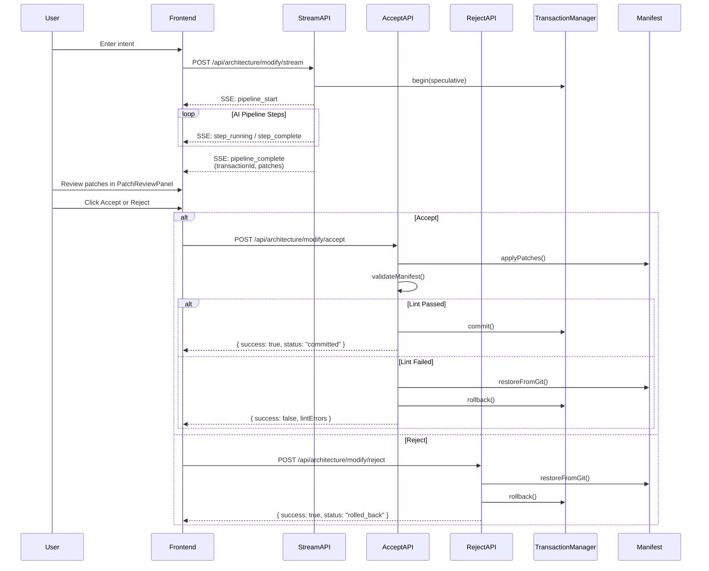

# Architecture Modification API

Documents the HTTP API endpoints for the two-phase architecture modification flow.

## Overview

The architecture modification API implements a two-phase workflow:

1. **Generate Phase**: `/api/architecture/modify/stream` — Accepts a natural language intent, executes the AI pipeline via SSE streaming, returns patches and a `transactionId`
2. **Review Phase**: `/api/architecture/modify/accept` or `/api/architecture/modify/reject` — User reviews patches and either commits or rolls back the transaction

## Sequence Diagram



---

## Endpoints

### POST /api/architecture/modify/stream

Executes the AI pipeline for architecture modification using Server-Sent Events (SSE) for real-time progress updates.

**URL:** `/api/architecture/modify/stream`

**Method:** `POST`

**Content-Type:** `application/json`

**Request Body:**

| Field          | Type     | Required | Description                                                    |
| -------------- | -------- | -------- | -------------------------------------------------------------- |
| `intent`       | `string` | Yes      | Natural language intent describing the desired change          |
| `manifestPath` | `string` | No       | Path to manifest file (default: `.architecture/manifest.yaml`) |
| `lineage`      | `object` | No       | IntentLineage metadata for tracking                            |

**Request Example:**

```json
{
  "intent": "Add a new bounded context called 'ordering' for handling customer orders",
  "manifestPath": ".architecture/manifest.yaml"
}
```

**Response:** `text/event-stream`

**SSE Event Types:**

| Event               | Data Shape                                                              |
| ------------------- | ----------------------------------------------------------------------- |
| `pipeline_start`    | `{ intent: string }`                                                    |
| `step_running`      | `{ name: string }`                                                      |
| `step_complete`     | `{ name: string, status: PipelineStepStatus, durationMs: number }`      |
| `pipeline_complete` | `{ pipelineRunId, patchesApplied, lintPassed, transactionId, patches }` |
| `pipeline_error`    | `{ error: string }`                                                     |
| `error`             | `{ type: "error", message: string }`                                    |
| `: heartbeat`       | (comment-only keepalive every 15s)                                      |

**Pipeline Steps:**

1. `parse-nl-intent` — Parses natural language into structured intent
2. `compile-prompt` — Compiles the prompt for LLM inference
3. `llm-inference` — Calls LLM to generate patches
4. `reconcile` — Reconciles generated patches with existing manifest
5. `commit-patches` — Commits patches to transaction (speculative state)

**Response Example (pipeline_complete event):**

```json
{
  "pipelineRunId": "run-abc123",
  "patchesApplied": 3,
  "lintPassed": true,
  "transactionId": "tx-speculative-001",
  "patches": [
    {
      "id": "patch-001",
      "targetId": ".architecture/manifest.yaml",
      "type": "add",
      "target": "boundedContexts[2]",
      "payload": { "name": "ordering", "type": "core" }
    }
  ]
}
```

**Error Responses:**

| Status | Meaning                                     |
| ------ | ------------------------------------------- |
| `400`  | Invalid JSON body or missing `intent` field |

---

### POST /api/architecture/modify/accept

Commits a speculative transaction, applying its patches to the manifest after lint validation.

**URL:** `/api/architecture/modify/accept`

**Method:** `POST`

**Content-Type:** `application/json`

**Request Body:**

| Field           | Type     | Required | Description                                               |
| --------------- | -------- | -------- | --------------------------------------------------------- |
| `transactionId` | `string` | Yes      | Transaction ID from Phase 1 (pipeline_complete event)     |
| `manifestPath`  | `string` | No       | Path to manifest (default: `.architecture/manifest.yaml`) |

**Request Example:**

```json
{
  "transactionId": "tx-speculative-001",
  "manifestPath": ".architecture/manifest.yaml"
}
```

**Success Response (200):**

```json
{
  "success": true,
  "transactionId": "tx-speculative-001",
  "status": "committed",
  "patchesApplied": 3,
  "lintPassed": true
}
```

**Error Responses:**

| Status | Condition                                        | Body Example                                                                      |
| ------ | ------------------------------------------------ | --------------------------------------------------------------------------------- |
| `400`  | Missing `transactionId`                          | `{ "success": false, "error": "transactionId is required" }`                      |
| `404`  | Transaction not found                            | `{ "success": false, "error": "Transaction not found" }`                          |
| `409`  | Transaction not in `speculative` state           | `{ "success": false, "error": "Transaction is in 'committed' state..." }`         |
| `500`  | Lint validation failed (git restore also failed) | `{ "success": false, "error": "Lint validation failed...", "lintErrors": [...] }` |
| `500`  | Unexpected server error                          | `{ "success": false, "error": "Accept failed: unexpected error" }`                |

**Behavior:**

1. Retrieves transaction from `TransactionManager`
2. Verifies transaction is in `speculative` state
3. Applies patches to manifest via `ManifestMutation.applyPatches()`
4. Runs lint validation via `LintValidation.validateManifest()`
5. **If lint passes**: commits transaction, returns success
6. **If lint fails**: restores manifest from git, rolls back transaction, returns lint errors

---

### POST /api/architecture/modify/reject

Rolls back a speculative transaction, restoring the manifest from git and discarding patches.

**URL:** `/api/architecture/modify/reject`

**Method:** `POST`

**Content-Type:** `application/json`

**Request Body:**

| Field           | Type     | Required | Description                                               |
| --------------- | -------- | -------- | --------------------------------------------------------- |
| `transactionId` | `string` | Yes      | Transaction ID from Phase 1 (pipeline_complete event)     |
| `manifestPath`  | `string` | No       | Path to manifest (default: `.architecture/manifest.yaml`) |
| `reason`        | `string` | No       | Reason for rejection (default: `"User rejected"`)         |

**Request Example:**

```json
{
  "transactionId": "tx-speculative-001",
  "reason": "Patches do not match the intended scope"
}
```

**Success Response (200):**

```json
{
  "success": true,
  "transactionId": "tx-speculative-001",
  "status": "rolled_back",
  "reason": "Patches do not match the intended scope"
}
```

**Error Responses:**

| Status | Condition                              | Body Example                                                              |
| ------ | -------------------------------------- | ------------------------------------------------------------------------- |
| `400`  | Missing `transactionId`                | `{ "success": false, "error": "transactionId is required" }`              |
| `404`  | Transaction not found                  | `{ "success": false, "error": "Transaction not found" }`                  |
| `409`  | Transaction not in `speculative` state | `{ "success": false, "error": "Transaction is in 'committed' state..." }` |
| `500`  | Unexpected server error                | `{ "success": false, "error": "Reject failed: unexpected error" }`        |

**Behavior:**

1. Retrieves transaction from `TransactionManager`
2. Verifies transaction is in `speculative` state
3. Restores manifest from git via `ManifestMutation.restoreFromGit()` (defensive — may fail silently)
4. Rolls back transaction via `TransactionManager.rollback(transactionId, reason)`
5. Returns success with rollback status

---

## Error Codes

| HTTP Status | Error Code                                                  | Description                                   |
| ----------- | ----------------------------------------------------------- | --------------------------------------------- |
| `400`       | `transactionId is required`                                 | Missing required field                        |
| `400`       | `Invalid manifest path`                                     | Path traversal detected                       |
| `400`       | `'intent' must be a non-empty string`                       | Empty or missing intent field                 |
| `404`       | `Transaction not found`                                     | No transaction exists with given ID           |
| `409`       | `Transaction is in '{state}' state, expected 'speculative'` | Invalid state transition                      |
| `500`       | `Lint validation failed`                                    | Lint errors found; manifest restored from git |
| `500`       | `Lint validation failed and git restore failed`             | Manual intervention required                  |
| `500`       | `Accept failed: unexpected error`                           | Internal server error                         |
| `500`       | `Reject failed: unexpected error`                           | Internal server error                         |

---

## Security

### Path Validation

All endpoints validate the `manifestPath` parameter to prevent path traversal attacks:

```typescript
function validateManifestPath(rawPath: string): string {
  const cwd = process.cwd();
  const allowedBase = path.join(cwd, ".architecture");
  const resolvedPath = path.resolve(cwd, rawPath);

  if (
    !resolvedPath.startsWith(allowedBase + path.sep) &&
    resolvedPath !== allowedBase
  ) {
    throw new Error(
      "Invalid path: traversal detected. Path must be within .architecture directory.",
    );
  }
  return resolvedPath;
}
```

### Transaction Isolation

Transactions are identified by UUID and isolated by the `TransactionManager`. Only the transaction creator (via `transactionId`) can accept or reject a transaction.
