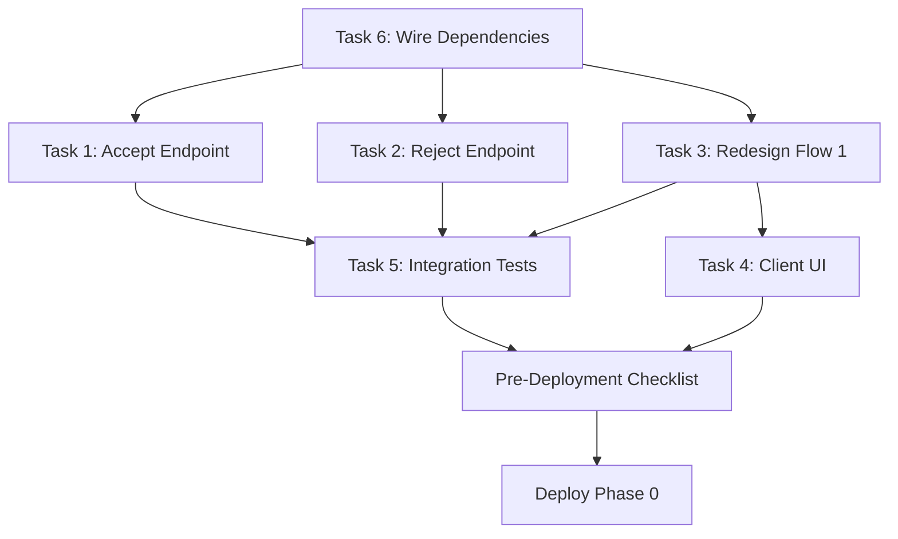

# Critical Updates to Phased Flow 3 Fix Strategy

**Date:** 2026-04-27
**Parent Document:** [PHASED-FLOW3-FIX-STRATEGY-2026-04-27.md](PHASED-FLOW3-FIX-STRATEGY-2026-04-27.md)
**Status:** REQUIRED BEFORE IMPLEMENTATION

---

## Overview

This document addresses 6 critical issues identified in the initial strategy that must be fixed before delegating implementation.

---

## Issue 1: Singleton Caching for Wire Dependencies

**Problem:** Creating new instances on every call breaks transaction lookup.

**Location:** `apps/web/app/lib/wire.server.ts` (lines 288-305 in strategy)

**Fix:**

```typescript
// apps/web/app/lib/wire.server.ts

// Add singleton caching to prevent transaction lookup failures
let _transactionManager: InMemoryTransactionManager | null = null;
let _manifestMutation: SyncDelegatingManifestMutationAdapter | null = null;
let _lintValidation: InMemoryLintValidationAdapter | null = null;

export const getTransactionManager = () => {
  if (!_transactionManager) {
    _transactionManager = new InMemoryTransactionManager();
  }
  return _transactionManager;
};

export const getManifestMutation = () => {
  if (!_manifestMutation) {
    _manifestMutation = new SyncDelegatingManifestMutationAdapter(
      process.cwd(),
    );
  }
  return _manifestMutation;
};

export const getLintValidation = () => {
  if (!_lintValidation) {
    _lintValidation = new InMemoryLintValidationAdapter();
  }
  return _lintValidation;
};

// Update existing clearModifyArchitectureCache to also clear these
export const clearModifyArchitectureCache = (): void => {
  cachedUseCase = null;
  cachedMode = null;
  _transactionManager = null;
  _manifestMutation = null;
  _lintValidation = null;
};
```

---

## Issue 2: Path Traversal Validation Missing

**Problem:** Accept endpoint doesn't validate manifest path, allowing directory traversal attacks.

**Location:** `apps/web/app/api/architecture/modify/accept/route.ts` (line 82 in strategy)

**Fix:**

```typescript
// Add to top of accept/route.ts after imports

/**
 * Validates that a manifest path is within the allowed .architecture directory.
 * Prevents directory traversal attacks by normalizing and checking path boundaries.
 * @throws {Error} If path traversal is detected
 */
function validateManifestPath(rawPath: string): string {
  const cwd = process.cwd();
  const allowedBase = path.join(cwd, ".architecture");
  const resolvedPath = path.resolve(cwd, rawPath);

  if (
    !resolvedPath.startsWith(allowedBase + path.sep) &&
    resolvedPath !== allowedBase
  ) {
    throw new Error(
      `Invalid path: traversal detected. Path must be within .architecture directory.`,
    );
  }

  return resolvedPath;
}

// Then update line 150-156 in strategy:

// OLD
const resolvedManifestPath =
  manifestPath ?? path.join(process.cwd(), ".architecture/manifest.yaml");

// NEW
const defaultPath = path.join(process.cwd(), ".architecture/manifest.yaml");
const rawPath = manifestPath ?? defaultPath;

// Validate path to prevent directory traversal
let resolvedManifestPath: string;
try {
  resolvedManifestPath = validateManifestPath(rawPath);
} catch (err) {
  const message = err instanceof Error ? err.message : "Invalid manifest path";
  return NextResponse.json({ success: false, error: message }, { status: 400 });
}
```

---

## Issue 3: Defensive Manifest Restore in Reject Endpoint

**Problem:** Reject endpoint assumes patches were never applied, but existing in-flight transactions may have mutated manifests.

**Location:** `apps/web/app/api/architecture/modify/reject/route.ts` (lines 420-429 in strategy)

**Fix:**

```typescript
// Replace lines 420-429 in strategy with:

logger.info("[api/architecture/modify/reject] Rejecting patches", {
  transactionId,
  reason: rejectionReason,
});

// Rollback transaction
const rolledBackTx = transactionManager.rollback(
  transactionId,
  rejectionReason,
);
if (!rolledBackTx) {
  logger.error(
    "[api/architecture/modify/reject] Failed to rollback transaction",
  );

  return NextResponse.json(
    {
      success: false,
      error: `Failed to rollback transaction ${transactionId}`,
    },
    { status: 500 },
  );
}

// Defensive: Restore manifest even though patches shouldn't have been applied
// This handles edge case of in-flight transactions from old broken behavior
const defaultPath = path.join(process.cwd(), ".architecture/manifest.yaml");
const rawPath = manifestPath ?? defaultPath;

let resolvedManifestPath: string | undefined;
try {
  resolvedManifestPath = validateManifestPath(rawPath);
} catch (err) {
  logger.warn(
    "[api/architecture/modify/reject] Invalid manifest path, skipping restore",
    {
      error: err instanceof Error ? err.message : String(err),
    },
  );
  // Continue anyway since transaction is already rolled back
}

if (resolvedManifestPath) {
  const restoreResult =
    await manifestMutation.restoreFromGit(resolvedManifestPath);
  if (!restoreResult.success) {
    logger.warn(
      "[api/architecture/modify/reject] Manifest restore failed (non-critical)",
      {
        error: restoreResult.error.message,
      },
    );
    // Non-critical: transaction is rolled back, restore is defensive
  }
}
```

**Also add `validateManifestPath()` function to reject endpoint (same as Issue 2).**

---

## Issue 4: SSE Route Update for `lintPassed: null`

**Problem:** Task 3 redesigns Flow 1 to return `lintPassed: null`, but SSE route isn't updated to handle this.

**Location:** `apps/web/app/api/architecture/modify/stream/route.ts` (lines 143-149)

**Fix:**

```typescript
// Add to Task 3 scope in strategy document:

// 4. Update SSE route to handle lintPassed: null

// apps/web/app/api/architecture/modify/stream/route.ts:143-149

// The existing code already handles this correctly:
if (result.success) {
  send("pipeline_complete", {
    pipelineRunId: result.value.pipelineRunId,
    patchesApplied: result.value.patchesApplied,
    lintPassed: result.value.lintPassed, // Can be null now
    transactionId: result.value.transactionId,
    patches: result.value.patches ?? [],
  });
}

// No code change needed, but update TypeScript interface:
// packages/agentic-interaction/src/application/ports/in/architecture-modification.port.ts

export interface ModificationResult {
  pipelineRunId: string;
  patchesApplied: number;
  lintPassed: boolean | null; // UPDATED: null = not validated yet
  transactionId: string;
  steps: PipelineStep[];
  patches: Patch[];
}
```

---

## Issue 5: Design Token Compliance for PatchReviewPanel

**Problem:** Component uses arbitrary Tailwind colors instead of design tokens.

**Location:** `apps/web/features/governance-assistant/architecture-modification/PatchReviewPanel.tsx` (line 618 in strategy)

**Fix:**

```typescript
// OLD
<Card className="border-amber-200 bg-amber-50">
  <CardHeader>
    <CardTitle className="flex items-center gap-2">
      <AlertTriangle className="h-5 w-5 text-amber-600" />
      Review Required
    </CardTitle>

// NEW
<Card className="border-warning/30 bg-warning/10">
  <CardHeader>
    <CardTitle className="flex items-center gap-2">
      <AlertTriangle className="h-5 w-5 text-warning" />
      Review Required
    </CardTitle>
```

**If `--warning` token doesn't exist, add to `apps/web/app/globals.css`:**

```css
:root {
  --warning: 38 92% 50%; /* amber-500 equivalent */
}

.dark {
  --warning: 48 96% 53%; /* amber-400 equivalent */
}
```

---

## Issue 6: Test Mocks for Server-Side Imports

**Problem:** Test imports server-side route handlers without mocking dependencies.

**Location:** `apps/web/__tests__/api/architecture/modify/accept.test.ts`, `apps/web/__tests__/api/architecture/modify/reject.test.ts`

**Fix:**

Tests use `node:test` + `node:assert/strict` (NOT Vitest). Dependencies are wired via singleton getters from `wire.server.ts`, so we use real instances with `clearModifyArchitectureCache()` between tests instead of mocks:

```typescript
import { describe, it } from "node:test";
import assert from "node:assert/strict";
import { NextRequest } from "next/server";
import {
  getTransactionManager,
  clearModifyArchitectureCache,
} from "../../../app/lib/wire.server.js";

function makeRequest(body: unknown): NextRequest {
  return new NextRequest(
    "http://localhost:3000/api/architecture/modify/accept",
    {
      method: "POST",
      headers: { "Content-Type": "application/json" },
      body: JSON.stringify(body),
    },
  );
}

describe("POST /api/architecture/modify/accept", () => {
  afterEach(() => clearModifyArchitectureCache());

  it("should return 400 if transactionId is missing", async () => {
    const { POST } =
      await import("../../../app/api/architecture/modify/accept/route.js");
    const response = await POST(makeRequest({}));
    assert.strictEqual(response.status, 400);
  });

  it("should return 404 if transaction not found", async () => {
    clearModifyArchitectureCache();
    const { POST } =
      await import("../../../app/api/architecture/modify/accept/route.js");
    const response = await POST(
      makeRequest({ transactionId: "nonexistent-txn" }),
    );
    assert.strictEqual(response.status, 404);
  });

  it("should return 409 if transaction is not in speculative state", async () => {
    clearModifyArchitectureCache();
    const txManager = getTransactionManager();
    const tx = txManager.begin("test-intent", {});
    const { POST } =
      await import("../../../app/api/architecture/modify/accept/route.js");
    const response = await POST(makeRequest({ transactionId: tx.id }));
    assert.strictEqual(response.status, 409);
    clearModifyArchitectureCache();
  });

  it("should reject path traversal in manifestPath", async () => {
    clearModifyArchitectureCache();
    const txManager = getTransactionManager();
    const tx = txManager.begin("test-intent", {});
    txManager.transition(tx.id, "speculative");
    const { POST } =
      await import("../../../app/api/architecture/modify/accept/route.js");
    const response = await POST(
      makeRequest({
        transactionId: tx.id,
        manifestPath: "../../etc/passwd",
      }),
    );
    assert.strictEqual(response.status, 400);
    clearModifyArchitectureCache();
  });
});
```

---

## Pre-Deployment Checklist

**Add this section before "Risk Mitigation" in the strategy document:**

### Before Deploying Phase 0:

1. ✅ **Ensure no in-flight transactions exist in production**
   - Query transaction manager for any `speculative` or `pending` transactions
   - If any exist, manually restore manifests before deployment

2. ✅ **Run full test suite**
   - `yarn build && yarn typecheck && yarn lint` — all must pass
   - `yarn test` — 100% pass rate required
   - Integration tests for accept/reject flow — all scenarios covered

3. ✅ **Security validation**
   - Test path validation with `../../etc/passwd` — must reject
   - Test path validation with `.architecture/../../../etc/passwd` — must reject
   - Test path validation with `.architecture/manifest.yaml` — must accept

4. ✅ **Singleton caching verification**
   - Create transaction in one request
   - Retrieve transaction in another request
   - Verify same instance returned (transaction found)

5. ✅ **Defensive restore verification**
   - Manually mutate manifest
   - Create speculative transaction
   - Call reject endpoint
   - Verify manifest restored to pre-mutation state

6. ✅ **Design token compliance**
   - Verify `--warning` token exists in `globals.css`
   - Verify `PatchReviewPanel` uses design tokens (no arbitrary colors)
   - Test in light and dark mode

7. ✅ **SSE route compatibility**
   - Verify `lintPassed: null` doesn't break client parsing
   - Verify client UI handles pending state correctly

---

## Updated Task Breakdown

### Task 1: Implement Accept Endpoint (5 hours, +1h)

- Original scope (4h)
- **+1h:** Add path validation function
- **+1h:** Add path validation to manifest resolution

### Task 2: Implement Reject Endpoint (3 hours, +1h)

- Original scope (2h)
- **+1h:** Add defensive manifest restore
- **+1h:** Add path validation function

### Task 3: Redesign Flow 1 (4 hours, +1h)

- Original scope (3h)
- **+1h:** Update `ModificationResult` interface
- **+1h:** Verify SSE route compatibility

### Task 4: Client-Side UI (4 hours, unchanged)

- Original scope (4h)
- **Note:** Update to use design tokens (no time change)

### Task 5: Integration Tests (4 hours, +1h)

- Original scope (3h)
- **+1h:** Add test mocks
- **+1h:** Add security tests (path validation)

### Task 6: Wire Dependencies (2 hours, NEW)

- **+2h:** Implement singleton caching in `wire.server.ts`
- **+2h:** Update `clearModifyArchitectureCache()`

**Updated Total:** 22 hours = 2.75 days (round up to 3 days)

---

## Revised Timeline

| Day       | Task                              | Hours   | Owner          |
| --------- | --------------------------------- | ------- | -------------- |
| **Day 1** | Task 6: Wire dependencies         | 2h      | Backend dev    |
|           | Task 1: Implement accept endpoint | 5h      | Backend dev    |
| **Day 2** | Task 2: Implement reject endpoint | 3h      | Backend dev    |
|           | Task 3: Redesign Flow 1           | 4h      | Backend dev    |
| **Day 3** | Task 4: Client-side UI            | 4h      | Frontend dev   |
|           | Task 5: Integration tests         | 4h      | QA/Backend dev |
|           | **Total**                         | **22h** | **3 days**     |

---

## Critical Path Dependencies



**Critical Path:** Task 6 → Task 1/2/3 → Task 5 → Deploy (3 days)
**Parallel Path:** Task 3 → Task 4 (can start Day 2)

---

## Success Criteria (Updated)

### Phase 0 (MVP)

- ✅ All 6 critical issues fixed
- ✅ Accept endpoint applies patches correctly (100% test coverage)
- ✅ Reject endpoint rolls back + restores correctly (100% test coverage)
- ✅ Path validation prevents directory traversal (security tests pass)
- ✅ Singleton caching works (transaction lookup tests pass)
- ✅ Flow 1 stops before mutation (verified by integration tests)
- ✅ Client UI shows accept/reject buttons (manual QA)
- ✅ Design tokens used (no arbitrary colors)
- ✅ End-to-end flow works: modify → preview → accept → manifest mutates

---

## Next Steps

1. **Review this addendum** — Confirm all 6 issues are addressed
2. **Update main strategy document** — Incorporate these fixes
3. **Delegate tasks:**
   - `delegate fix-flow-3-endpoints` → Backend dev (Tasks 1–3, 6)
   - `develop a2ui-phase-1` → Frontend dev (Task 4)
   - `delegate flow-1-hardening` → Backend dev (Phase 0b, post-launch)

---

**END OF CRITICAL UPDATES**
