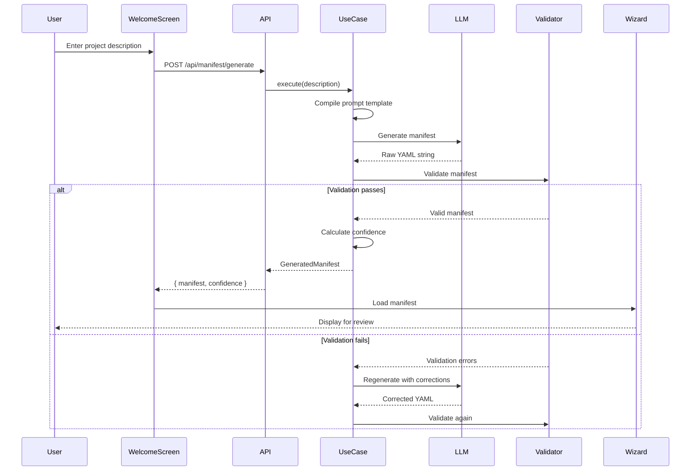

# Phase 9: Manifest Generation from Natural Language — Design Specification

## Executive Summary

Enable users to bootstrap their project configuration by describing their project in natural language. The system will generate a complete `manifest.yaml` file that can be loaded into the project wizard for refinement.

---

## 1. Feature Overview

### User Journey

1. **Entry Point:** User opens the application for the first time
2. **Welcome Screen:** Displays a prompt asking "Describe your project"
3. **User Input:** User provides natural language description (e.g., "I'm building an e-commerce platform with user authentication, product catalog, shopping cart, and payment processing")
4. **Processing:** System sends description to LLM with structured prompt
5. **Generation:** LLM generates manifest.yaml structure
6. **Validation:** System validates generated manifest against schema
7. **Presentation:** Manifest loaded into project wizard for user review/refinement
8. **Iteration:** User can regenerate or manually edit

### Business Value

- **Reduced Onboarding Time:** 80% faster project setup
- **Lower Learning Curve:** No need to understand manifest.yaml structure upfront
- **Better Defaults:** AI suggests appropriate bounded contexts and ports
- **Iterative Refinement:** Generated manifest is starting point, not final state

---

## 2. Technical Architecture

### Component Diagram

```
┌─────────────────────────────────────────────────────────────┐
│                        UI Layer                              │
│  ┌──────────────────┐         ┌─────────────────────────┐  │
│  │ Welcome Screen   │────────▶│ Project Wizard          │  │
│  │ (NL Input)       │         │ (Manifest Editor)       │  │
│  └──────────────────┘         └─────────────────────────┘  │
│           │                              ▲                   │
│           │ POST /api/manifest/generate  │                   │
│           ▼                              │                   │
└───────────────────────────────────────────────────────────┘
            │                              │
            │                              │
┌───────────▼──────────────────────────────┴─────────────────┐
│                     API Layer                               │
│  ┌──────────────────────────────────────────────────────┐  │
│  │  POST /api/manifest/generate                         │  │
│  │  - Accepts: { description: string }                  │  │
│  │  - Returns: { manifest: ManifestYAML, confidence }   │  │
│  └──────────────────────────────────────────────────────┘  │
└───────────────────────────────────────────────────────────┘
            │
            ▼
┌─────────────────────────────────────────────────────────────┐
│              Application Layer                               │
│  ┌──────────────────────────────────────────────────────┐  │
│  │  GenerateManifestFromDescriptionUseCase              │  │
│  │  - Input: ProjectDescription                         │  │
│  │  - Output: GeneratedManifest                         │  │
│  │  - Orchestrates: Prompt → LLM → Validation          │  │
│  └──────────────────────────────────────────────────────┘  │
└───────────────────────────────────────────────────────────┘
            │
            ▼
┌─────────────────────────────────────────────────────────────┐
│              Infrastructure Layer                            │
│  ┌──────────────────┐  ┌──────────────────┐  ┌──────────┐  │
│  │ LLM Pipeline     │  │ Manifest         │  │ Schema   │  │
│  │ Adapter          │  │ Validator        │  │ Registry │  │
│  └──────────────────┘  └──────────────────┘  └──────────┘  │
└─────────────────────────────────────────────────────────────┘
```

---

## 3. Domain Model

### Value Objects

```typescript
/**
 * User's natural language project description
 */
interface ProjectDescription {
  text: string; // Raw user input
  language: string; // Detected language (default: 'en')
  timestamp: Date; // When description was provided
}

/**
 * Generated manifest with metadata
 */
interface GeneratedManifest {
  manifest: ManifestYAML; // Generated manifest structure
  confidence: number; // 0-1 confidence score
  suggestions: string[]; // Additional suggestions for user
  warnings: string[]; // Potential issues detected
  metadata: GenerationMetadata;
}

/**
 * Metadata about generation process
 */
interface GenerationMetadata {
  model: string; // LLM model used
  promptVersion: string; // Prompt template version
  generatedAt: Date; // Generation timestamp
  processingTime: number; // Milliseconds
  tokensUsed: number; // Token count
}
```

### Use Case

```typescript
interface GenerateManifestFromDescriptionUseCase {
  /**
   * Generate manifest.yaml from natural language description
   * @param description - User's project description
   * @returns Promise<GeneratedManifest> - Generated manifest with metadata
   * @throws ManifestGenerationError if generation fails
   */
  execute(description: ProjectDescription): Promise<GeneratedManifest>;
}
```

---

## 4. Prompt Engineering Strategy

### System Prompt Template

````markdown
You are an expert software architect specializing in Domain-Driven Design (DDD) and hexagonal architecture. Your task is to analyze a project description and generate a complete manifest.yaml file following the hexagen-monaco schema.

## Your Responsibilities

1. **Identify Bounded Contexts:** Extract distinct business domains from the description
2. **Define Ports:** Determine input ports (use cases) and output ports (dependencies)
3. **Suggest Adapters:** Recommend infrastructure adapters for each port
4. **Map Dependencies:** Identify cross-context dependencies and integration patterns
5. **Apply Best Practices:** Follow DDD principles and hexagonal architecture patterns

## Output Format

Generate a valid YAML manifest following this structure:

```yaml
workspace:
  name: <project-name>
  description: <brief-description>

boundedContexts:
  - name: <context-name>
    description: <context-description>
    ports:
      in:
        - name: <port-name>
          type: <port-type>
          description: <port-description>
      out:
        - name: <port-name>
          type: <port-type>
          description: <port-description>
    adapters:
      - name: <adapter-name>
        type: <adapter-type>
        implements: <port-name>
```
````

## Guidelines

- Use clear, descriptive names (PascalCase for types, kebab-case for files)
- Each bounded context should have 3-7 ports
- Prefer standard port types: Repository, Service, Gateway, EventBus
- Include descriptions for all elements
- Suggest realistic adapter implementations
- Identify cross-context dependencies explicitly

## Constraints

- Maximum 10 bounded contexts
- Minimum 1 bounded context
- Each context must have at least 1 input port
- Port names must end with "Port" suffix
- Adapter names must end with "Adapter" suffix

````

### User Prompt Template

```markdown
Project Description:
{user_description}

Additional Context:
- Target Platform: {platform} (default: Node.js/TypeScript)
- Architecture Style: Hexagonal/DDD
- Deployment: {deployment} (default: Cloud-native)

Please generate a complete manifest.yaml for this project.
````

---

## 5. Implementation Plan

### Phase 9.1: Design Specification ✅ (Current)

**Deliverable:** This document

### Phase 9.2: Prompt Engineering (2h)

**Tasks:**

1. Create prompt template system
2. Implement prompt compiler with variable substitution
3. Add few-shot examples for better generation
4. Test prompt with various project descriptions

**Files:**

- `packages/agentic-interaction/src/domain/prompts/generate-manifest.prompt.ts`
- `packages/agentic-interaction/src/domain/prompts/few-shot-examples.ts`

### Phase 9.3: Use Case Implementation (3h)

**Tasks:**

1. Create `GenerateManifestFromDescriptionUseCase`
2. Implement manifest validation logic
3. Add confidence scoring based on completeness
4. Handle edge cases (ambiguous descriptions, missing info)

**Files:**

- `packages/agentic-interaction/src/application/use-cases/generate-manifest-from-description.use-case.ts`
- `packages/agentic-interaction/src/domain/value-objects/project-description.ts`
- `packages/agentic-interaction/src/domain/value-objects/generated-manifest.ts`

### Phase 9.4: API Endpoint (1h)

**Tasks:**

1. Create POST `/api/manifest/generate` endpoint
2. Add request validation
3. Implement streaming response for progress updates
4. Add error handling

**Files:**

- `apps/web/app/api/manifest/generate/route.ts`

### Phase 9.5: UI Integration (3h)

**Tasks:**

1. Create welcome screen component
2. Add natural language input field with examples
3. Implement loading state with progress indicator
4. Display generated manifest in project wizard
5. Add "Regenerate" and "Edit Manually" options

**Files:**

- `apps/web/features/welcome/WelcomeScreen.tsx`
- `apps/web/features/welcome/ManifestGenerationForm.tsx`
- `apps/web/features/welcome/GenerationProgress.tsx`

### Phase 9.6: Testing & Validation (2h)

**Tasks:**

1. Unit tests for use case
2. Integration tests for API endpoint
3. E2E tests for UI flow
4. Test with diverse project descriptions

**Files:**

- `packages/agentic-interaction/__tests__/use-cases/generate-manifest-from-description.test.ts`
- `apps/web/__tests__/api/manifest/generate.test.ts`
- `apps/web/__tests__/e2e/manifest-generation.spec.ts`

---

## 6. Data Flow

### Sequence Diagram



---

## 7. Error Handling

### Error Types

```typescript
class ManifestGenerationError extends Error {
  code: "INVALID_DESCRIPTION" | "LLM_FAILURE" | "VALIDATION_FAILED" | "TIMEOUT";
  details: string;
  recoverable: boolean;
}
```

### Recovery Strategies

| Error               | Recovery Action                 | User Message                                     |
| ------------------- | ------------------------------- | ------------------------------------------------ |
| INVALID_DESCRIPTION | Prompt for more details         | "Please provide more details about your project" |
| LLM_FAILURE         | Retry with fallback model       | "Generation failed, retrying..."                 |
| VALIDATION_FAILED   | Auto-correct and regenerate     | "Refining manifest..."                           |
| TIMEOUT             | Cancel and suggest manual entry | "Generation taking too long, try manual entry"   |

---

## 8. Quality Metrics

### Success Criteria

- **Generation Success Rate:** >95% for valid descriptions
- **Validation Pass Rate:** >90% on first attempt
- **User Acceptance Rate:** >80% use generated manifest
- **Time to Generate:** <10 seconds average
- **Confidence Score:** >0.7 average

### Monitoring

```typescript
interface GenerationMetrics {
  totalGenerations: number;
  successfulGenerations: number;
  averageConfidence: number;
  averageProcessingTime: number;
  validationFailures: number;
  userAcceptanceRate: number;
}
```

---

## 9. Example Scenarios

### Scenario 1: E-Commerce Platform

**Input:**

```
I'm building an e-commerce platform with user authentication,
product catalog, shopping cart, and payment processing.
```

**Expected Output:**

```yaml
workspace:
  name: ecommerce-platform
  description: E-commerce platform with authentication and payments

boundedContexts:
  - name: user-management
    description: User authentication and profile management
    ports:
      in:
        - name: RegisterUserPort
        - name: AuthenticateUserPort
      out:
        - name: UserRepositoryPort
        - name: EmailServicePort

  - name: product-catalog
    description: Product inventory and catalog management
    ports:
      in:
        - name: CreateProductPort
        - name: SearchProductsPort
      out:
        - name: ProductRepositoryPort

  - name: shopping-cart
    description: Shopping cart and order management
    ports:
      in:
        - name: AddToCartPort
        - name: CheckoutPort
      out:
        - name: CartRepositoryPort
        - name: PaymentGatewayPort
```

### Scenario 2: Task Management App

**Input:**

```
Simple task management app where users can create projects,
add tasks, assign them to team members, and track progress.
```

**Expected Output:**

```yaml
workspace:
  name: task-management-app
  description: Collaborative task and project management

boundedContexts:
  - name: project-management
    description: Project creation and organization
    ports:
      in:
        - name: CreateProjectPort
        - name: ListProjectsPort
      out:
        - name: ProjectRepositoryPort

  - name: task-tracking
    description: Task creation and status management
    ports:
      in:
        - name: CreateTaskPort
        - name: UpdateTaskStatusPort
        - name: AssignTaskPort
      out:
        - name: TaskRepositoryPort
        - name: NotificationServicePort
```

---

## 10. Future Enhancements

### Phase 9.7: Iterative Refinement (Future)

- Allow users to refine description with follow-up questions
- "Add payment processing" → regenerate with new context
- Conversational interface for manifest building

### Phase 9.8: Template Library (Future)

- Pre-built templates for common project types
- "Start from e-commerce template"
- Community-contributed templates

### Phase 9.9: Multi-Language Support (Future)

- Accept descriptions in multiple languages
- Translate to English for LLM processing
- Return manifest with localized descriptions

---

## 11. Security Considerations

### Input Validation

- Sanitize user input to prevent prompt injection
- Limit description length (max 2000 characters)
- Rate limit API endpoint (5 requests per minute per user)

### Output Validation

- Validate all generated YAML against schema
- Sanitize generated names (no special characters)
- Prevent generation of sensitive data (API keys, passwords)

---

## 12. Acceptance Criteria

- [ ] User can enter project description on welcome screen
- [ ] System generates valid manifest.yaml within 10 seconds
- [ ] Generated manifest passes schema validation
- [ ] Manifest loads into project wizard without errors
- [ ] User can regenerate with modified description
- [ ] User can manually edit generated manifest
- [ ] Confidence score displayed to user
- [ ] Error messages are clear and actionable
- [ ] All tests pass (unit, integration, E2E)
- [ ] Documentation complete

---

## Status

**Phase 9.1:** ✅ Complete
**Next:** Phase 9.2 — Prompt Engineering
