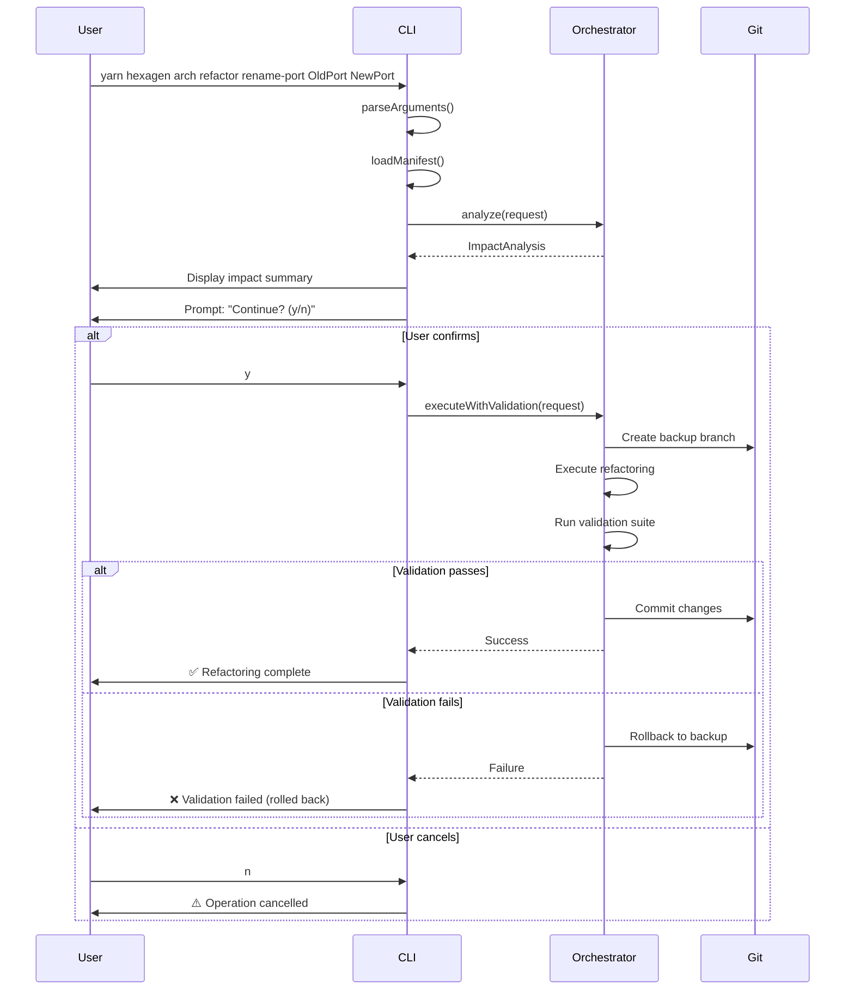

# CLI Integration — Technical Documentation

## 1. Identity & Intent

**Domain Responsibility:** Provide command-line interface for refactoring operations with interactive confirmation, progress reporting, and user-friendly error messages.

**Architectural Classification:** Driving Adapter (CLI Interface)

**Package:** `@hexagen/sync`
**Location:** `packages/sync/src/commands/arch/refactor.ts`

---

## 2. Use-Case Catalog

| Problem                                | Solution                                              | Business Value           |
| -------------------------------------- | ----------------------------------------------------- | ------------------------ |
| Developers need safe refactoring tools | CLI commands with validation and rollback             | Productivity improvement |
| Uncertain refactoring impact           | Interactive confirmation with detailed impact display | Informed decision-making |
| Accidental destructive operations      | Requires explicit confirmation before mutations       | Safety guarantee         |
| Complex command syntax                 | Intuitive subcommands with helpful error messages     | Low learning curve       |
| Need to preview changes                | `--dry-run` flag for impact analysis only             | Risk-free exploration    |

### Edge Cases

**Q: What happens if user cancels during confirmation?**
A: Operation aborts immediately. No files modified, no git operations performed.

**Q: How does it handle non-interactive environments (CI/CD)?**
A: Use `--yes` flag to skip confirmation prompts. Validation still runs unless `--skip-validation` specified.

**Q: What if terminal doesn't support colors?**
A: Falls back to plain text output. All information still displayed, just without color formatting.

---

## 3. Implementation Blueprint

### Dependency Graph

**Internal Dependencies:**

- `../../refactoring/safe-refactoring-orchestrator` — Orchestration
- `../../refactoring/impact-analyzer` — Impact analysis
- `../../manifest-service` — Manifest loading
- `../../logger` — Logging utilities
- `commander` — CLI framework
- `readline` — Interactive prompts

**External Dependencies:**

- `commander` — CLI argument parsing
- Node.js `readline` — User input

### Interface Contract

```typescript
interface RefactorCommand {
  /**
   * Register refactor command with Commander
   * @returns Command - Commander command instance
   */
  register(): Command;
}

// Command structure
const refactorCommand = new Command("refactor")
  .description("Safe architectural refactoring operations")
  .addCommand(renamePortCommand)
  .addCommand(renameUseCaseCommand)
  .addCommand(renameEntityCommand)
  .addCommand(analyzeCommand);

// Subcommand: rename-port
const renamePortCommand = new Command("rename-port")
  .description("Rename a port interface and all references")
  .argument("<current-name>", "Current port name (e.g., UserRepositoryPort)")
  .argument("<new-name>", "New port name (e.g., UserStoragePort)")
  .option("--dry-run", "Preview changes without applying")
  .option("--skip-validation", "Skip build/lint validation (dangerous)")
  .option("--no-auto-commit", "Do not auto-commit on success")
  .action(async (currentName, newName, options) => {
    // Implementation
  });
```

### Command Flow



---

## 4. Executable Examples

### The Happy Path — Interactive Refactoring

```bash
# Rename a port with interactive confirmation
yarn hexagen arch refactor rename-port UserRepositoryPort UserStoragePort

# Output:
# 📊 Impact Analysis:
#   Files to modify: 8
#   Cross-package dependencies: 2
#   Complexity: medium
#
# 📦 Packages affected:
#   - @hexagen/agentic-interaction
#   - @hexagen/web-driver
#
# ⚠️  Warnings:
#   - Port has cross-package dependencies
#
# Continue with refactoring? (y/n): y
#
# 🔄 Creating git backup branch...
# ✅ Backup created: refactor-backup-20260428-060634
#
# 🔨 Executing refactoring...
# ✅ Modified 8 files
#
# 🔍 Running validation suite...
#   ✅ Build: passed (12.3s)
#   ✅ Typecheck: passed (3.2s)
#   ✅ Lint: passed (2.1s)
#   ✅ Arch-lint: passed (1.5s)
#
# 💾 Committing changes...
# ✅ Refactoring complete!
```

### Advanced Configuration — Dry-Run Preview

```bash
# Preview impact without making changes
yarn hexagen arch refactor analyze --type port --target UserRepositoryPort --new-name UserStoragePort

# Or use subcommand with --dry-run
yarn hexagen arch refactor rename-port UserRepositoryPort UserStoragePort --dry-run

# Output:
# 📊 Impact Analysis (DRY RUN):
#   Files to modify: 8
#     - packages/agentic-interaction/src/application/ports/in/user-repository.port.ts
#     - packages/agentic-interaction/src/infrastructure/adapters/postgres-user.adapter.ts
#     - packages/agentic-interaction/src/infrastructure/adapters/index.ts
#     - packages/web-driver/src/composition-root.ts
#     - ... (4 more files)
#
#   Cross-package dependencies: 2
#     - @hexagen/web-driver → @hexagen/agentic-interaction
#     - @hexagen/mcp-server → @hexagen/agentic-interaction
#
#   Complexity: medium
#
# ⚠️  Warnings:
#   - Port has cross-package dependencies
#   - Requires barrel export updates in 2 packages
#
# 💡 To execute: remove --dry-run flag
```

### Fast Iteration — Skip Validation

```bash
# Skip validation for fast iteration (use with caution)
yarn hexagen arch refactor rename-entity User UserAccount --skip-validation

# Output:
# ⚠️  WARNING: Validation skipped
# ⚠️  Manual verification required after refactoring
#
# 📊 Impact Analysis:
#   Files to modify: 12
#   Complexity: high
#
# Continue? (y/n): y
#
# 🔨 Executing refactoring...
# ✅ Modified 12 files
#
# ⚠️  Validation skipped — run manually:
#   yarn build && yarn typecheck && yarn lint:arch
#
# 💾 Changes committed
```

### Non-Interactive Mode — CI/CD

```bash
# Auto-confirm for CI/CD pipelines
yarn hexagen arch refactor rename-use-case CreateUser RegisterUser --yes

# Or use environment variable
HEXAGEN_AUTO_CONFIRM=true yarn hexagen arch refactor rename-use-case CreateUser RegisterUser
```

### The "Failure State" — Validation Failure

```bash
yarn hexagen arch refactor rename-port PaymentPort PaymentGatewayPort

# Output:
# 📊 Impact Analysis:
#   Files to modify: 15
#   Complexity: high
#
# Continue? (y/n): y
#
# 🔄 Creating git backup branch...
# ✅ Backup created: refactor-backup-20260428-060745
#
# 🔨 Executing refactoring...
# ✅ Modified 15 files
#
# 🔍 Running validation suite...
#   ✅ Build: passed (14.2s)
#   ✅ Typecheck: passed (3.8s)
#   ❌ Lint: failed (2.3s)
#   ⏭️  Arch-lint: skipped
#
# ❌ Validation failed:
#
# Lint errors:
#   packages/payment/src/adapters/stripe-payment-gateway.adapter.ts:42:5
#     error: 'PaymentGatewayPort' is not defined
#
# 🔄 Rolling back to backup branch...
# ✅ Rollback complete — original state restored
#
# ❌ Refactoring failed
# Exit code: 1
```

---

## 5. Quality Heuristics

### Command Structure

```
yarn hexagen arch refactor <subcommand> [arguments] [options]

Subcommands:
  rename-port <current> <new>      Rename port interface
  rename-use-case <current> <new>  Rename use case
  rename-entity <current> <new>    Rename domain entity
  analyze                          Analyze refactoring impact

Global Options:
  --dry-run              Preview changes without applying
  --skip-validation      Skip build/lint validation
  --no-auto-commit       Do not auto-commit on success
  --yes                  Auto-confirm prompts (non-interactive)
  -h, --help            Display help
```

### User Confirmation Flow

```typescript
async function promptConfirmation(impact: ImpactAnalysis): Promise<boolean> {
  // Display impact summary
  console.log("\n📊 Impact Analysis:");
  console.log(`  Files to modify: ${impact.filesToModify.length}`);
  console.log(
    `  Cross-package dependencies: ${impact.crossPackageDeps.length}`,
  );
  console.log(`  Complexity: ${impact.estimatedComplexity}`);

  // Display warnings
  if (impact.warnings.length > 0) {
    console.log("\n⚠️  Warnings:");
    impact.warnings.forEach((w) => console.log(`  - ${w}`));
  }

  // Prompt user
  const rl = readline.createInterface({
    input: process.stdin,
    output: process.stdout,
  });

  return new Promise((resolve) => {
    rl.question("\nContinue with refactoring? (y/n): ", (answer) => {
      rl.close();
      resolve(answer.toLowerCase() === "y");
    });
  });
}
```

### Error Message Formatting

```typescript
function formatError(error: OrchestrationError): string {
  const messages: string[] = ["❌ Refactoring failed\n"];

  switch (error.code) {
    case "VALIDATION_FAILED":
      messages.push("🔍 Validation errors:");
      error.validationErrors.forEach((err) => {
        messages.push(`  ${err.file}:${err.line}:${err.column}`);
        messages.push(`    ${err.message}`);
      });
      break;

    case "GIT_BACKUP_FAILED":
      messages.push("🔄 Failed to create git backup");
      messages.push("Ensure:");
      messages.push("  - Git is installed");
      messages.push("  - Working directory is clean");
      messages.push("  - You have write permissions");
      break;

    case "TARGET_NOT_FOUND":
      messages.push(`🔍 Target not found: ${error.target}`);
      messages.push("Available targets:");
      error.availableTargets.forEach((t) => messages.push(`  - ${t}`));
      break;

    default:
      messages.push(error.message);
  }

  if (error.rollbackPerformed) {
    messages.push("\n✅ Rollback complete — original state restored");
  }

  return messages.join("\n");
}
```

### Progress Reporting

```typescript
function reportProgress(phase: string, status: "start" | "success" | "error") {
  const icons = {
    start: "🔄",
    success: "✅",
    error: "❌",
  };

  const messages = {
    "git-backup": "Creating git backup branch",
    "impact-analysis": "Analyzing refactoring impact",
    refactoring: "Executing refactoring",
    validation: "Running validation suite",
    commit: "Committing changes",
    rollback: "Rolling back to backup",
  };

  console.log(`${icons[status]} ${messages[phase]}...`);
}
```

### Performance Characteristics

| Operation             | User Feedback              | Typical Duration |
| --------------------- | -------------------------- | ---------------- |
| Argument parsing      | Immediate                  | <10ms            |
| Manifest loading      | "Loading manifest..."      | 50-200ms         |
| Impact analysis       | "Analyzing impact..."      | 500ms-2s         |
| User confirmation     | Interactive prompt         | User-dependent   |
| Refactoring execution | "Executing refactoring..." | 100-500ms        |
| Validation suite      | Progress per command       | 10-60s           |
| Commit                | "Committing changes..."    | 100-500ms        |

### Exit Codes

| Code | Meaning           | When                                 |
| ---- | ----------------- | ------------------------------------ |
| 0    | Success           | Refactoring completed successfully   |
| 1    | Validation failed | Build/lint/typecheck failed          |
| 2    | User cancelled    | User declined confirmation           |
| 3    | Target not found  | Port/use-case/entity not in manifest |
| 4    | Git error         | Backup or rollback failed            |
| 5    | Permission error  | File write permission denied         |

### Related Files

- [`packages/sync/src/commands/arch/refactor.ts`](../../packages/sync/src/commands/arch/refactor.ts) — CLI implementation
- [`packages/sync/src/cli.ts`](../../packages/sync/src/cli.ts) — Main CLI entry point
- [`packages/sync/src/refactoring/safe-refactoring-orchestrator.ts`](../../packages/sync/src/refactoring/safe-refactoring-orchestrator.ts)
- [`packages/sync/README.md`](../../packages/sync/README.md) — Package documentation
