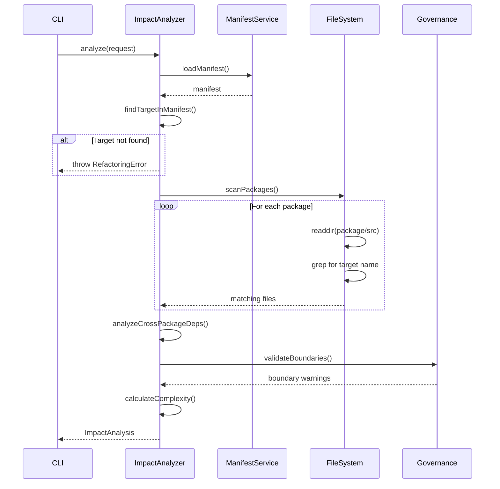

# Impact Analyzer — Technical Documentation

## 1. Identity & Intent

**Domain Responsibility:** Analyze cross-package dependencies and predict refactoring impact across architectural boundaries before code mutation.

**Architectural Classification:** Application Service (Use Case)

**Package:** `@hexagen/sync`
**Location:** `packages/sync/src/refactoring/impact-analyzer.ts`

---

## 2. Use-Case Catalog

| Problem                                                            | Solution                                                                   | Business Value                              |
| ------------------------------------------------------------------ | -------------------------------------------------------------------------- | ------------------------------------------- |
| Developer renames port without knowing which adapters depend on it | Scans all packages for import references and reports affected files        | Prevents broken builds and runtime failures |
| Refactoring breaks cross-package boundaries                        | Validates architectural rules from manifest.yaml before suggesting changes | Maintains hexagonal architecture integrity  |
| Uncertain scope of change                                          | Provides file count, package count, and dependency graph                   | Enables informed decision-making            |
| Hidden transitive dependencies                                     | Traces import chains across package boundaries                             | Reveals full impact scope                   |
| Barrel export complexity                                           | Detects when refactoring requires barrel re-exports                        | Prevents incomplete refactorings            |

### Edge Cases

**Q: How does this handle circular dependencies?**
A: Tracks visited packages in a Set to prevent infinite loops. Reports circular dependencies as warnings in impact analysis.

**Q: What happens if manifest.yaml is out of sync with actual code?**
A: Analyzer uses file system scanning as source of truth. Manifest provides architectural context but doesn't block analysis.

**Q: How does it handle dynamic imports or runtime dependencies?**
A: Only analyzes static imports. Dynamic imports are reported as warnings in the impact report.

---

## 3. Implementation Blueprint

### Dependency Graph

**Internal Dependencies:**

- `../../manifest-service` — Load and parse manifest.yaml
- `../types` — RefactoringRequest, ImpactAnalysis types
- `fs/promises` — File system scanning
- `path` — Path resolution

**External Dependencies:**

- `@hexagen/governance` — Architectural boundary validation
- `@hexagen/project-configuration` — Manifest schema types

### Interface Contract

```typescript
interface ImpactAnalyzer {
  /**
   * Analyze refactoring impact across all packages
   * @param request - Refactoring request with type, target, and new name
   * @returns Promise<ImpactAnalysis> - Complete impact report
   * @throws RefactoringError if target not found or invalid
   */
  analyze(request: RefactoringRequest): Promise<ImpactAnalysis>;
}

interface RefactoringRequest {
  type: "port" | "use-case" | "entity";
  target: string; // Current name (e.g., "UserRepositoryPort")
  newName: string; // Desired name (e.g., "UserStoragePort")
}

interface ImpactAnalysis {
  request: RefactoringRequest;
  filesToModify: string[]; // Absolute paths to files requiring changes
  crossPackageDeps: CrossPackageDep[]; // Cross-boundary dependencies
  warnings: string[]; // Architectural or complexity warnings
  estimatedComplexity: "low" | "medium" | "high";
}

interface CrossPackageDep {
  fromPackage: string; // Source package name
  toPackage: string; // Target package name
  importPath: string; // Import statement
  file: string; // File containing import
}
```

### Logic Flow



---

## 4. Executable Examples

### The Happy Path

```typescript
import { ImpactAnalyzer } from "@hexagen/sync/refactoring/impact-analyzer";
import { loadManifest } from "@hexagen/sync/manifest-service";

async function analyzePortRename() {
  const workspaceRoot = process.cwd();

  // Load manifest
  const manifestResult = await loadManifest(workspaceRoot);
  if (!manifestResult.success) {
    throw new Error(`Failed to load manifest: ${manifestResult.error.message}`);
  }

  // Create analyzer
  const analyzer = new ImpactAnalyzer(workspaceRoot, manifestResult.data);

  // Analyze impact
  const impact = await analyzer.analyze({
    type: "port",
    target: "UserRepositoryPort",
    newName: "UserStoragePort",
  });

  // Review results
  console.log(`Files to modify: ${impact.filesToModify.length}`);
  console.log(`Cross-package dependencies: ${impact.crossPackageDeps.length}`);
  console.log(`Complexity: ${impact.estimatedComplexity}`);

  if (impact.warnings.length > 0) {
    console.warn("Warnings:", impact.warnings);
  }

  return impact;
}
```

### Advanced Configuration

```typescript
import { ImpactAnalyzer } from "@hexagen/sync/refactoring/impact-analyzer";

// Custom analyzer with package filtering
class FilteredImpactAnalyzer extends ImpactAnalyzer {
  private packagesToScan: string[];

  constructor(workspaceRoot: string, manifest: any, packagesToScan: string[]) {
    super(workspaceRoot, manifest);
    this.packagesToScan = packagesToScan;
  }

  async analyze(request: RefactoringRequest): Promise<ImpactAnalysis> {
    const fullImpact = await super.analyze(request);

    // Filter to only specified packages
    return {
      ...fullImpact,
      filesToModify: fullImpact.filesToModify.filter((file) =>
        this.packagesToScan.some((pkg) => file.includes(`packages/${pkg}/`)),
      ),
      crossPackageDeps: fullImpact.crossPackageDeps.filter(
        (dep) =>
          this.packagesToScan.includes(dep.fromPackage) ||
          this.packagesToScan.includes(dep.toPackage),
      ),
    };
  }
}

// Usage
const analyzer = new FilteredImpactAnalyzer(
  workspaceRoot,
  manifest,
  ["agentic-interaction", "web-driver"], // Only scan these packages
);
```

### The "Failure State"

```typescript
import { ImpactAnalyzer } from "@hexagen/sync/refactoring/impact-analyzer";
import { RefactoringError } from "@hexagen/sync/refactoring/types";

async function safeAnalyze() {
  try {
    const analyzer = new ImpactAnalyzer(workspaceRoot, manifest);
    const impact = await analyzer.analyze({
      type: "port",
      target: "NonExistentPort",
      newName: "NewPort",
    });

    return impact;
  } catch (error) {
    if (error instanceof RefactoringError) {
      // Domain-specific error handling
      switch (error.code) {
        case "TARGET_NOT_FOUND":
          console.error(`Port not found in manifest: ${error.target}`);
          console.error("Available ports:", error.availableTargets);
          break;

        case "INVALID_NAME":
          console.error(`Invalid new name: ${error.message}`);
          console.error("Name must match pattern: [A-Z][a-zA-Z0-9]*Port");
          break;

        case "CIRCULAR_DEPENDENCY":
          console.error("Circular dependency detected:", error.cycle);
          break;

        default:
          console.error("Refactoring error:", error.message);
      }

      process.exit(1);
    }

    // Unexpected error
    throw error;
  }
}
```

---

## 5. Quality Heuristics

### Complexity Calculation

```typescript
function calculateComplexity(
  impact: ImpactAnalysis,
): "low" | "medium" | "high" {
  const fileCount = impact.filesToModify.length;
  const crossPackageCount = impact.crossPackageDeps.length;
  const warningCount = impact.warnings.length;

  if (fileCount > 20 || crossPackageCount > 5 || warningCount > 3) {
    return "high";
  }

  if (fileCount > 10 || crossPackageCount > 2 || warningCount > 1) {
    return "medium";
  }

  return "low";
}
```

### Performance Characteristics

- **File Scanning:** O(n) where n = total files in packages/
- **Dependency Analysis:** O(m) where m = number of import statements
- **Memory:** Loads entire manifest into memory (~1-5MB typical)
- **Typical Runtime:** 500ms-2s for medium-sized monorepo

### Architectural Boundaries

The Impact Analyzer respects these boundaries:

1. **Never modifies files** — Read-only analysis
2. **No network calls** — Pure file system operations
3. **No git operations** — Delegates to SafeRefactoringOrchestrator
4. **Manifest as context** — Uses manifest for validation, not as source of truth

### Related Files

- [`packages/sync/src/refactoring/types.ts`](../../packages/sync/src/refactoring/types.ts) — Type definitions
- [`packages/sync/src/manifest-service.ts`](../../packages/sync/src/manifest-service.ts) — Manifest loading
- [`.architecture/manifest.yaml`](../../.architecture/manifest.yaml) — Architectural boundaries
