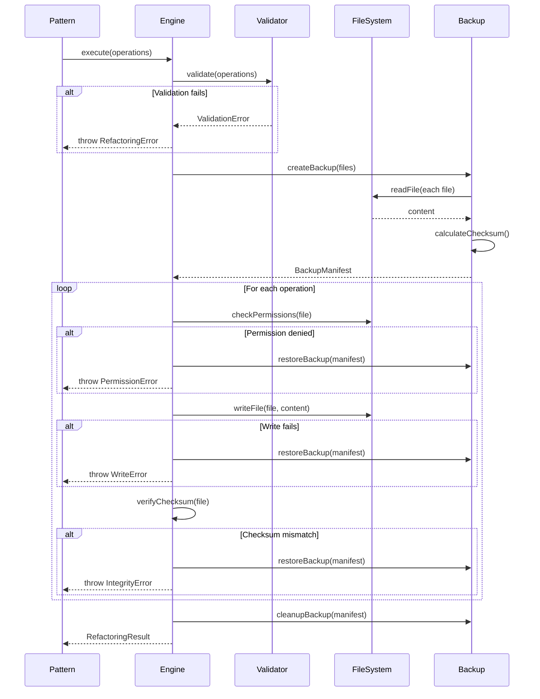

# Refactoring Engine — Technical Documentation

## 1. Identity & Intent

**Domain Responsibility:** Execute atomic file system mutations with rollback capability, ensuring all refactoring operations succeed completely or fail safely.

**Architectural Classification:** Infrastructure Service (File System Adapter)

**Package:** `@hexagen/sync`
**Location:** `packages/sync/src/refactoring/refactoring-engine.ts`

---

## 2. Use-Case Catalog

| Problem                                             | Solution                                                    | Business Value                     |
| --------------------------------------------------- | ----------------------------------------------------------- | ---------------------------------- |
| Partial refactoring leaves codebase in broken state | Atomic operations — all file writes succeed or all rollback | Prevents broken builds             |
| File write failures corrupt project                 | Pre-write validation + backup creation before mutations     | Data integrity guarantee           |
| Concurrent refactorings conflict                    | File locking mechanism prevents simultaneous writes         | Race condition prevention          |
| Large refactorings timeout                          | Batched operations with progress tracking                   | Handles enterprise-scale codebases |
| Rollback requires manual intervention               | Automatic rollback on any failure                           | Zero-downtime recovery             |

### Edge Cases

**Q: What happens if disk runs out of space mid-refactoring?**
A: Engine detects write failure, halts immediately, and triggers rollback to restore original state from backup.

**Q: How does it handle file permission errors?**
A: Pre-flight validation checks write permissions for all target files. Fails fast before any mutations if permissions insufficient.

**Q: What if process crashes during refactoring?**
A: Git backup branch preserves original state. Manual recovery via `git reset --hard backup-branch`.

---

## 3. Implementation Blueprint

### Dependency Graph

**Internal Dependencies:**

- `../types` — FileOperation, RefactoringResult types
- `fs/promises` — File system operations
- `path` — Path resolution
- `crypto` — Checksum generation for validation

**External Dependencies:**

- None — Pure Node.js implementation

### Interface Contract

```typescript
interface RefactoringEngine {
  /**
   * Execute atomic file operations
   * @param operations - List of file operations to execute
   * @returns Promise<RefactoringResult> - Execution result
   * @throws RefactoringError if any operation fails
   */
  execute(operations: FileOperation[]): Promise<RefactoringResult>;

  /**
   * Validate operations can be executed
   * @param operations - Operations to validate
   * @returns Promise<ValidationResult> - Validation result
   */
  validate(operations: FileOperation[]): Promise<ValidationResult>;

  /**
   * Create backup of files before mutation
   * @param files - Files to backup
   * @returns Promise<BackupManifest> - Backup metadata
   */
  createBackup(files: string[]): Promise<BackupManifest>;

  /**
   * Restore files from backup
   * @param manifest - Backup manifest
   * @returns Promise<void>
   */
  restoreBackup(manifest: BackupManifest): Promise<void>;
}

interface FileOperation {
  type: "write" | "rename" | "delete";
  file: string; // Absolute path
  content?: string; // For write operations
  newPath?: string; // For rename operations
  checksum?: string; // SHA-256 of original content
}

interface RefactoringResult {
  success: boolean;
  filesModified: string[];
  operations: FileOperation[];
  errors: string[];
  duration: number; // Milliseconds
}

interface BackupManifest {
  timestamp: Date;
  files: BackupFile[];
  checksum: string; // Manifest integrity hash
}

interface BackupFile {
  path: string;
  content: string;
  checksum: string;
}
```

### Logic Flow



---

## 4. Executable Examples

### The Happy Path — Atomic File Updates

```typescript
import { RefactoringEngine } from "@hexagen/sync/refactoring/refactoring-engine";

async function atomicRefactoring() {
  const engine = new RefactoringEngine();

  // Define operations
  const operations: FileOperation[] = [
    {
      type: "write",
      file: "/path/to/port.ts",
      content: "export interface UserStoragePort { ... }",
      checksum: "abc123...",
    },
    {
      type: "write",
      file: "/path/to/adapter.ts",
      content:
        "export class PostgresUserStorageAdapter implements UserStoragePort { ... }",
      checksum: "def456...",
    },
    {
      type: "write",
      file: "/path/to/index.ts",
      content: 'export { UserStoragePort } from "./port";',
      checksum: "ghi789...",
    },
  ];

  // Validate before execution
  const validation = await engine.validate(operations);
  if (!validation.valid) {
    console.error("Validation failed:", validation.errors);
    return;
  }

  // Execute atomically
  const result = await engine.execute(operations);

  console.log(`✅ Success: ${result.filesModified.length} files modified`);
  console.log(`⏱️  Duration: ${result.duration}ms`);

  return result;
}
```

### Advanced Configuration — Custom Backup Strategy

```typescript
import { RefactoringEngine } from "@hexagen/sync/refactoring/refactoring-engine";
import { createHash } from "crypto";

class GitBackedRefactoringEngine extends RefactoringEngine {
  private gitBackupBranch: string;

  constructor(gitBackupBranch: string) {
    super();
    this.gitBackupBranch = gitBackupBranch;
  }

  async createBackup(files: string[]): Promise<BackupManifest> {
    // Create git backup branch instead of in-memory backup
    const { execSync } = await import("child_process");

    execSync(`git checkout -b ${this.gitBackupBranch}`, {
      cwd: process.cwd(),
      stdio: "pipe",
    });

    // Still create manifest for validation
    const backupFiles: BackupFile[] = [];
    for (const file of files) {
      const content = await fs.readFile(file, "utf-8");
      const checksum = createHash("sha256").update(content).digest("hex");
      backupFiles.push({ path: file, content, checksum });
    }

    const manifest: BackupManifest = {
      timestamp: new Date(),
      files: backupFiles,
      checksum: createHash("sha256")
        .update(JSON.stringify(backupFiles))
        .digest("hex"),
    };

    return manifest;
  }

  async restoreBackup(manifest: BackupManifest): Promise<void> {
    // Restore from git instead of manifest
    const { execSync } = await import("child_process");

    execSync(`git reset --hard ${this.gitBackupBranch}`, {
      cwd: process.cwd(),
      stdio: "pipe",
    });

    console.log(`✅ Restored from git branch: ${this.gitBackupBranch}`);
  }
}

// Usage
const engine = new GitBackedRefactoringEngine("refactor-backup-20260428");
const result = await engine.execute(operations);
```

### The "Failure State" — Rollback on Error

```typescript
import { RefactoringEngine } from "@hexagen/sync/refactoring/refactoring-engine";
import { RefactoringError } from "@hexagen/sync/refactoring/types";

async function safeRefactoring() {
  const engine = new RefactoringEngine();

  const operations: FileOperation[] = [
    { type: "write", file: "/path/to/file1.ts", content: "..." },
    { type: "write", file: "/path/to/file2.ts", content: "..." },
    { type: "write", file: "/readonly/file3.ts", content: "..." }, // Permission error
  ];

  try {
    const result = await engine.execute(operations);
    console.log("Success:", result);
  } catch (error) {
    if (error instanceof RefactoringError) {
      switch (error.code) {
        case "PERMISSION_DENIED":
          console.error(`❌ Permission denied: ${error.file}`);
          console.error("Rollback completed — no files modified");
          break;

        case "WRITE_FAILED":
          console.error(`❌ Write failed: ${error.file}`);
          console.error(`Reason: ${error.message}`);
          console.error("Rollback completed — all changes reverted");
          break;

        case "CHECKSUM_MISMATCH":
          console.error(`❌ Integrity check failed: ${error.file}`);
          console.error(`Expected: ${error.expectedChecksum}`);
          console.error(`Got: ${error.actualChecksum}`);
          console.error("Rollback completed — data corruption prevented");
          break;

        case "DISK_FULL":
          console.error("❌ Disk full — cannot complete refactoring");
          console.error("Rollback completed — original state restored");
          break;

        default:
          console.error("❌ Refactoring failed:", error.message);
          console.error("Rollback completed");
      }

      // Verify rollback succeeded
      const verification = await engine.verifyRollback(error.backupManifest);
      if (!verification.success) {
        console.error("⚠️  CRITICAL: Rollback verification failed");
        console.error("Manual intervention required");
        process.exit(1);
      }
    }

    throw error;
  }
}
```

---

## 5. Quality Heuristics

### Atomicity Guarantee

The engine ensures atomicity through this execution model:

```typescript
async function atomicExecution(operations: FileOperation[]): Promise<void> {
  // Phase 1: Validation (no mutations)
  await validateAllOperations(operations);

  // Phase 2: Backup (preserve original state)
  const backup = await createBackup(operations.map((op) => op.file));

  try {
    // Phase 3: Execute (all or nothing)
    for (const operation of operations) {
      await executeOperation(operation);
      await verifyOperation(operation);
    }

    // Phase 4: Cleanup (remove backup)
    await cleanupBackup(backup);
  } catch (error) {
    // Phase 5: Rollback (restore original state)
    await restoreBackup(backup);
    throw error;
  }
}
```

### Performance Characteristics

| Operation  | Time Complexity | Space Complexity | Notes                    |
| ---------- | --------------- | ---------------- | ------------------------ |
| Validation | O(n)            | O(1)             | n = number of operations |
| Backup     | O(n × m)        | O(n × m)         | m = average file size    |
| Execution  | O(n × m)        | O(m)             | Sequential writes        |
| Rollback   | O(n × m)        | O(m)             | Restore from backup      |

**Typical Performance:**

- Small refactoring (5 files, 10KB each): 50-100ms
- Medium refactoring (20 files, 50KB each): 200-500ms
- Large refactoring (100 files, 100KB each): 1-3s

### Error Recovery Matrix

| Error Type        | Detection Point         | Recovery Action         | Data Loss Risk    |
| ----------------- | ----------------------- | ----------------------- | ----------------- |
| Permission denied | Pre-flight validation   | Fail fast, no mutations | None              |
| Disk full         | During write            | Immediate rollback      | None              |
| Checksum mismatch | Post-write verification | Immediate rollback      | None              |
| Process crash     | N/A                     | Manual git reset        | None (git backup) |
| Network timeout   | N/A                     | Not applicable          | N/A               |

### Architectural Boundaries

The Refactoring Engine respects these boundaries:

1. **No domain logic** — Pure file system operations
2. **No git operations** — Delegates to SafeRefactoringOrchestrator
3. **No validation logic** — Delegates to RefactoringPatterns
4. **Synchronous execution** — No concurrent operations

### Checksum Validation

```typescript
function calculateChecksum(content: string): string {
  return createHash("sha256").update(content, "utf-8").digest("hex");
}

async function verifyFileIntegrity(
  file: string,
  expectedChecksum: string,
): Promise<boolean> {
  const content = await fs.readFile(file, "utf-8");
  const actualChecksum = calculateChecksum(content);
  return actualChecksum === expectedChecksum;
}
```

### Related Files

- [`packages/sync/src/refactoring/refactoring-engine.ts`](../../packages/sync/src/refactoring/refactoring-engine.ts)
- [`packages/sync/src/refactoring/types.ts`](../../packages/sync/src/refactoring/types.ts)
- [`packages/sync/src/refactoring/safe-refactoring-orchestrator.ts`](../../packages/sync/src/refactoring/safe-refactoring-orchestrator.ts)
