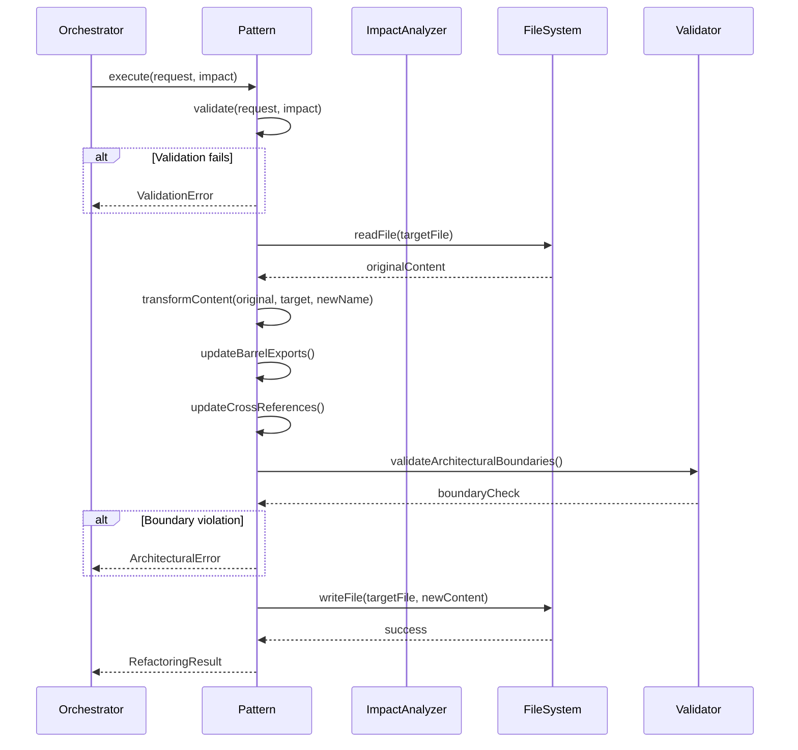

# Refactoring Patterns — Technical Documentation

## 1. Identity & Intent

**Domain Responsibility:** Execute domain-specific refactoring operations (rename port, use case, entity) with architectural boundary awareness and type-safe transformations.

**Architectural Classification:** Domain Service (Refactoring Strategy Pattern)

**Package:** `@hexagen/sync`
**Location:** `packages/sync/src/refactoring/patterns/`

---

## 2. Use-Case Catalog

| Problem                                           | Solution                                                                                  | Business Value                                 |
| ------------------------------------------------- | ----------------------------------------------------------------------------------------- | ---------------------------------------------- |
| Port rename breaks adapter implementations        | RenamePortPattern updates port interface + all adapter implementations + barrel exports   | Maintains hexagonal architecture integrity     |
| Use case rename orphans composition root bindings | RenameUseCasePattern updates use case class + composition root + test doubles + MCP tools | Prevents runtime dependency injection failures |
| Entity rename breaks domain logic                 | RenameEntityPattern updates entity class + value objects + aggregates + repositories      | Preserves domain model consistency             |
| Manual refactoring misses barrel exports          | All patterns automatically update index.ts barrel files                                   | Prevents broken public API surface             |
| Inconsistent naming conventions                   | Patterns enforce naming rules (e.g., ports must end with "Port")                          | Maintains codebase conventions                 |

### Edge Cases

**Q: What happens if a port is used in multiple packages?**
A: RenamePortPattern scans all packages and updates every reference. Cross-package dependencies are tracked in impact analysis.

**Q: How does it handle ports with multiple adapters?**
A: Pattern identifies all adapters implementing the port interface and updates each one. Validates that all adapters are updated before committing.

**Q: What if a use case is registered in multiple MCP servers?**
A: RenameUseCasePattern scans all MCP server registration files and updates tool definitions. Reports warning if MCP tool schema needs manual update.

---

## 3. Implementation Blueprint

### Dependency Graph

**Internal Dependencies:**

- `../types` — RefactoringRequest, RefactoringResult types
- `../impact-analyzer` — Impact analysis
- `fs/promises` — File system operations
- `path` — Path resolution

**External Dependencies:**

- `@hexagen/governance` — Architectural validation
- TypeScript AST parser (future) — For precise code transformations

### Interface Contract

```typescript
interface RefactoringPattern {
  /**
   * Execute refactoring pattern
   * @param request - Refactoring request with target and new name
   * @param impact - Pre-computed impact analysis
   * @returns Promise<RefactoringResult> - Execution result with modified files
   * @throws RefactoringError if pattern execution fails
   */
  execute(
    request: RefactoringRequest,
    impact: ImpactAnalysis,
  ): Promise<RefactoringResult>;

  /**
   * Validate that pattern can be safely executed
   * @param request - Refactoring request
   * @param impact - Impact analysis
   * @returns ValidationResult with errors/warnings
   */
  validate(
    request: RefactoringRequest,
    impact: ImpactAnalysis,
  ): ValidationResult;
}

interface RefactoringResult {
  success: boolean;
  filesModified: string[]; // Absolute paths to modified files
  operations: FileOperation[]; // Detailed operation log
  errors: string[]; // Execution errors
}

interface FileOperation {
  type: "rename" | "update-content" | "update-barrel";
  file: string;
  oldContent?: string;
  newContent?: string;
  timestamp: Date;
}

interface ValidationResult {
  valid: boolean;
  errors: string[];
  warnings: string[];
}
```

### Pattern Implementations

#### 1. RenamePortPattern

**Scope:** Port interface + all implementing adapters + barrel exports

**Naming Rules:**

- Must end with "Port"
- PascalCase required
- No special characters

**Files Modified:**

```
packages/{package}/src/application/ports/in/{port-name}.port.ts
packages/{package}/src/application/ports/in/index.ts
packages/{package}/src/infrastructure/adapters/{adapter-name}.adapter.ts
packages/{package}/src/infrastructure/adapters/index.ts
```

#### 2. RenameUseCasePattern

**Scope:** Use case class + composition root + test doubles + MCP tools

**Naming Rules:**

- Must end with "UseCase"
- PascalCase required
- Verb-noun structure (e.g., "CreateUserUseCase")

**Files Modified:**

```
packages/{package}/src/application/use-cases/{use-case-name}.use-case.ts
packages/{package}/src/application/use-cases/index.ts
packages/{package}/src/composition-root.ts
packages/{package}/__tests__/doubles/{use-case-name}.double.ts
packages/mcp-server/src/tools/{use-case-name}.tool.ts
```

#### 3. RenameEntityPattern

**Scope:** Entity class + value objects + aggregates + repositories

**Naming Rules:**

- PascalCase required
- Singular noun (e.g., "User", not "Users")
- No "Entity" suffix

**Files Modified:**

```
packages/{package}/src/domain/model/{entity-name}.ts
packages/{package}/src/domain/model/index.ts
packages/{package}/src/domain/value-objects/{entity-name}-id.ts
packages/{package}/src/application/ports/out/{entity-name}-repository.port.ts
```

### Logic Flow



---

## 4. Executable Examples

### The Happy Path — Rename Port

```typescript
import { RenamePortPattern } from "@hexagen/sync/refactoring/patterns/rename-port";
import { ImpactAnalyzer } from "@hexagen/sync/refactoring/impact-analyzer";

async function renamePort() {
  const workspaceRoot = process.cwd();
  const manifest = await loadManifest(workspaceRoot);

  // Analyze impact
  const analyzer = new ImpactAnalyzer(workspaceRoot, manifest.data);
  const impact = await analyzer.analyze({
    type: "port",
    target: "UserRepositoryPort",
    newName: "UserStoragePort",
  });

  // Execute pattern
  const pattern = new RenamePortPattern(workspaceRoot);
  const result = await pattern.execute(
    { type: "port", target: "UserRepositoryPort", newName: "UserStoragePort" },
    impact,
  );

  console.log(`✅ Modified ${result.filesModified.length} files`);
  console.log(
    "Operations:",
    result.operations.map((op) => op.type),
  );

  return result;
}
```

### Advanced Configuration — Custom Validation

```typescript
import { RenameUseCasePattern } from "@hexagen/sync/refactoring/patterns/rename-use-case";

class StrictRenameUseCasePattern extends RenameUseCasePattern {
  validate(
    request: RefactoringRequest,
    impact: ImpactAnalysis,
  ): ValidationResult {
    const baseValidation = super.validate(request, impact);

    // Add custom validation rules
    const errors = [...baseValidation.errors];
    const warnings = [...baseValidation.warnings];

    // Enforce verb-noun structure
    const verbNounPattern = /^[A-Z][a-z]+[A-Z][a-zA-Z]*UseCase$/;
    if (!verbNounPattern.test(request.newName)) {
      errors.push(
        `Use case name must follow verb-noun pattern (e.g., CreateUserUseCase). Got: ${request.newName}`,
      );
    }

    // Warn if cross-package dependencies exist
    if (impact.crossPackageDeps.length > 0) {
      warnings.push(
        `Use case has ${impact.crossPackageDeps.length} cross-package dependencies. Review carefully.`,
      );
    }

    // Fail if complexity is high
    if (impact.estimatedComplexity === "high") {
      errors.push(
        "Refactoring complexity is HIGH. Consider breaking into smaller changes.",
      );
    }

    return {
      valid: errors.length === 0,
      errors,
      warnings,
    };
  }
}

// Usage
const pattern = new StrictRenameUseCasePattern(workspaceRoot);
const validation = pattern.validate(request, impact);

if (!validation.valid) {
  console.error("Validation failed:", validation.errors);
  process.exit(1);
}
```

### The "Failure State" — Pattern Execution Error

```typescript
import { RenameEntityPattern } from "@hexagen/sync/refactoring/patterns/rename-entity";
import { RefactoringError } from "@hexagen/sync/refactoring/types";

async function safeRenameEntity() {
  try {
    const pattern = new RenameEntityPattern(workspaceRoot);
    const result = await pattern.execute(request, impact);

    if (!result.success) {
      console.error("Pattern execution failed:");
      result.errors.forEach((err) => console.error(`  - ${err}`));
      process.exit(1);
    }

    return result;
  } catch (error) {
    if (error instanceof RefactoringError) {
      switch (error.code) {
        case "FILE_NOT_FOUND":
          console.error(`Target file not found: ${error.file}`);
          console.error("Ensure entity exists in manifest and file system");
          break;

        case "WRITE_FAILED":
          console.error(`Failed to write file: ${error.file}`);
          console.error("Check file permissions and disk space");
          break;

        case "BARREL_UPDATE_FAILED":
          console.error("Failed to update barrel exports");
          console.error("Manual intervention required for index.ts files");
          break;

        case "ARCHITECTURAL_VIOLATION":
          console.error("Refactoring violates architectural boundaries:");
          error.violations.forEach((v) => console.error(`  - ${v}`));
          break;

        default:
          console.error("Pattern execution error:", error.message);
      }

      // Rollback handled by SafeRefactoringOrchestrator
      process.exit(1);
    }

    throw error;
  }
}
```

---

## 5. Quality Heuristics

### Pattern Selection Logic

```typescript
function selectPattern(type: RefactoringRequest["type"]): RefactoringPattern {
  switch (type) {
    case "port":
      return new RenamePortPattern(workspaceRoot);
    case "use-case":
      return new RenameUseCasePattern(workspaceRoot);
    case "entity":
      return new RenameEntityPattern(workspaceRoot);
    default:
      throw new Error(`Unknown refactoring type: ${type}`);
  }
}
```

### Naming Convention Enforcement

| Pattern  | Suffix Required | Case       | Example               |
| -------- | --------------- | ---------- | --------------------- |
| Port     | "Port"          | PascalCase | `UserRepositoryPort`  |
| Use Case | "UseCase"       | PascalCase | `CreateUserUseCase`   |
| Entity   | None            | PascalCase | `User`                |
| Adapter  | "Adapter"       | PascalCase | `PostgresUserAdapter` |

### Atomic Operation Guarantee

All patterns follow this execution model:

1. **Read Phase** — Load all files into memory
2. **Transform Phase** — Apply transformations to in-memory content
3. **Validate Phase** — Verify architectural boundaries
4. **Write Phase** — Write all files atomically (all succeed or all fail)

### Performance Characteristics

- **File Operations:** Batched writes for efficiency
- **Memory:** Loads modified files into memory (~10-50KB per file)
- **Typical Runtime:** 100-500ms per pattern execution
- **Rollback Cost:** O(1) — git reset to backup branch

### Related Files

- [`packages/sync/src/refactoring/patterns/rename-port.ts`](../../packages/sync/src/refactoring/patterns/rename-port.ts)
- [`packages/sync/src/refactoring/patterns/rename-use-case.ts`](../../packages/sync/src/refactoring/patterns/rename-use-case.ts)
- [`packages/sync/src/refactoring/patterns/rename-entity.ts`](../../packages/sync/src/refactoring/patterns/rename-entity.ts)
- [`packages/sync/src/refactoring/types.ts`](../../packages/sync/src/refactoring/types.ts)
