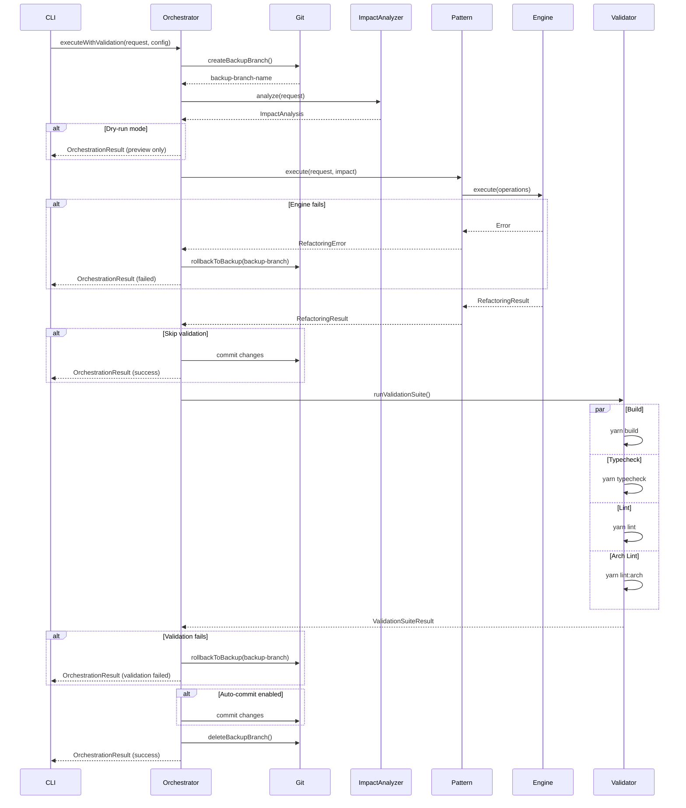

# Safe Refactoring Orchestrator — Technical Documentation

## 1. Identity & Intent

**Domain Responsibility:** Orchestrate validated, git-backed refactoring workflows with automatic rollback on failure, ensuring architectural integrity throughout execution.

**Architectural Classification:** Application Service (Orchestration Layer)

**Package:** `@hexagen/sync`
**Location:** `packages/sync/src/refactoring/safe-refactoring-orchestrator.ts`

---

## 2. Use-Case Catalog

| Problem                               | Solution                                                                      | Business Value                   |
| ------------------------------------- | ----------------------------------------------------------------------------- | -------------------------------- |
| Refactoring breaks build              | Creates git backup branch before mutations, validates with `yarn build` after | Zero-downtime deployments        |
| Architectural boundaries violated     | Runs `yarn lint:arch` validation before and after changes                     | Maintains hexagonal architecture |
| Failed refactoring leaves broken code | Automatic rollback to backup branch on any failure                            | Production stability guarantee   |
| Manual validation steps forgotten     | Enforces validation suite execution (build, typecheck, lint, arch-lint)       | Quality assurance automation     |
| Unclear refactoring status            | Progress tracking with detailed logging                                       | Observable operations            |

### Edge Cases

**Q: What happens if validation suite times out?**
A: Orchestrator has configurable timeout (default 5 minutes). On timeout, triggers rollback and reports failure.

**Q: How does it handle git conflicts during rollback?**
A: Uses `git reset --hard` to backup branch, which cannot conflict. Original state always recoverable.

**Q: What if backup branch already exists?**
A: Generates unique branch name with timestamp (e.g., `refactor-backup-20260428-060634`). Never overwrites existing branches.

---

## 3. Implementation Blueprint

### Dependency Graph

**Internal Dependencies:**

- `./impact-analyzer` — Pre-execution impact analysis
- `./refactoring-patterns` — Pattern selection and execution
- `./refactoring-engine` — File system mutations
- `../manifest-service` — Manifest loading
- `child_process` — Git and validation commands

**External Dependencies:**

- `@hexagen/governance` — Architectural validation
- Git — Version control operations
- Yarn — Build and validation commands

### Interface Contract

```typescript
interface SafeRefactoringOrchestrator {
  /**
   * Execute refactoring with full validation and rollback safety
   * @param request - Refactoring request
   * @param config - Execution configuration
   * @returns Promise<OrchestrationResult> - Complete execution result
   * @throws OrchestrationError if execution fails
   */
  executeWithValidation(
    request: RefactoringRequest,
    config?: OrchestrationConfig,
  ): Promise<OrchestrationResult>;

  /**
   * Create git backup branch
   * @returns Promise<string> - Backup branch name
   */
  createBackupBranch(): Promise<string>;

  /**
   * Rollback to backup branch
   * @param branchName - Backup branch to restore
   * @returns Promise<void>
   */
  rollbackToBackup(branchName: string): Promise<void>;

  /**
   * Run validation suite
   * @param config - Validation configuration
   * @returns Promise<ValidationSuiteResult>
   */
  runValidationSuite(config: ValidationConfig): Promise<ValidationSuiteResult>;
}

interface OrchestrationConfig {
  skipValidation?: boolean; // Skip validation suite (dangerous)
  autoCommit?: boolean; // Auto-commit on success (default: true)
  validationTimeout?: number; // Timeout in milliseconds (default: 300000)
  dryRun?: boolean; // Preview only, no mutations
}

interface OrchestrationResult {
  success: boolean;
  backupBranch: string;
  impactAnalysis: ImpactAnalysis;
  refactoringResult: RefactoringResult;
  validationResult: ValidationSuiteResult;
  duration: number; // Total milliseconds
  rollbackPerformed: boolean;
}

interface ValidationSuiteResult {
  build: CommandResult;
  typecheck: CommandResult;
  lint: CommandResult;
  archLint: CommandResult;
  allPassed: boolean;
}

interface CommandResult {
  command: string;
  exitCode: number;
  stdout: string;
  stderr: string;
  duration: number;
}
```

### Logic Flow



---

## 4. Executable Examples

### The Happy Path — Full Validation

```typescript
import { SafeRefactoringOrchestrator } from "@hexagen/sync/refactoring/safe-refactoring-orchestrator";

async function safeRefactoring() {
  const workspaceRoot = process.cwd();
  const manifest = await loadManifest(workspaceRoot);

  const orchestrator = new SafeRefactoringOrchestrator(
    workspaceRoot,
    manifest.data,
  );

  const result = await orchestrator.executeWithValidation({
    type: "port",
    target: "UserRepositoryPort",
    newName: "UserStoragePort",
  });

  if (result.success) {
    console.log("✅ Refactoring complete");
    console.log(
      `📦 Modified ${result.refactoringResult.filesModified.length} files`,
    );
    console.log(`⏱️  Duration: ${result.duration}ms`);
    console.log(
      `🔍 Validation: ${result.validationResult.allPassed ? "PASSED" : "FAILED"}`,
    );
  } else {
    console.error("❌ Refactoring failed");
    if (result.rollbackPerformed) {
      console.log("🔄 Rollback completed — original state restored");
    }
  }

  return result;
}
```

### Advanced Configuration — Custom Validation

```typescript
import { SafeRefactoringOrchestrator } from "@hexagen/sync/refactoring/safe-refactoring-orchestrator";

async function fastRefactoring() {
  const orchestrator = new SafeRefactoringOrchestrator(workspaceRoot, manifest);

  // Skip validation for fast iteration (use with caution)
  const result = await orchestrator.executeWithValidation(
    {
      type: "entity",
      target: "User",
      newName: "UserAccount",
    },
    {
      skipValidation: true, // Skip build/lint validation
      autoCommit: false, // Manual commit control
      validationTimeout: 60000, // 1 minute timeout
    },
  );

  if (result.success) {
    console.log("⚠️  Validation skipped — manual verification required");
    console.log("Run: yarn build && yarn typecheck && yarn lint:arch");
    console.log('Then: git commit -m "refactor: rename User to UserAccount"');
  }

  return result;
}
```

### Dry-Run Mode — Preview Changes

```typescript
import { SafeRefactoringOrchestrator } from "@hexagen/sync/refactoring/safe-refactoring-orchestrator";

async function previewRefactoring() {
  const orchestrator = new SafeRefactoringOrchestrator(workspaceRoot, manifest);

  // Dry-run: analyze impact without mutations
  const result = await orchestrator.executeWithValidation(
    {
      type: "use-case",
      target: "CreateUserUseCase",
      newName: "RegisterUserUseCase",
    },
    {
      dryRun: true, // No file mutations, no git operations
    },
  );

  console.log("📊 Impact Analysis:");
  console.log(
    `  Files to modify: ${result.impactAnalysis.filesToModify.length}`,
  );
  console.log(
    `  Cross-package deps: ${result.impactAnalysis.crossPackageDeps.length}`,
  );
  console.log(`  Complexity: ${result.impactAnalysis.estimatedComplexity}`);

  if (result.impactAnalysis.warnings.length > 0) {
    console.log("\n⚠️  Warnings:");
    result.impactAnalysis.warnings.forEach((w) => console.log(`  - ${w}`));
  }

  console.log("\n💡 To execute: remove --dry-run flag");

  return result;
}
```

### The "Failure State" — Rollback Recovery

```typescript
import { SafeRefactoringOrchestrator } from "@hexagen/sync/refactoring/safe-refactoring-orchestrator";
import { OrchestrationError } from "@hexagen/sync/refactoring/types";

async function resilientRefactoring() {
  const orchestrator = new SafeRefactoringOrchestrator(workspaceRoot, manifest);

  try {
    const result = await orchestrator.executeWithValidation({
      type: "port",
      target: "PaymentPort",
      newName: "PaymentGatewayPort",
    });

    if (!result.success) {
      console.error("❌ Refactoring failed");

      // Analyze failure
      if (!result.validationResult.allPassed) {
        console.error("\n🔍 Validation Failures:");

        if (result.validationResult.build.exitCode !== 0) {
          console.error("  Build failed:");
          console.error(result.validationResult.build.stderr);
        }

        if (result.validationResult.archLint.exitCode !== 0) {
          console.error("  Architecture lint failed:");
          console.error(result.validationResult.archLint.stderr);
        }
      }

      if (result.rollbackPerformed) {
        console.log("\n✅ Rollback completed");
        console.log(`   Restored to: ${result.backupBranch}`);
      }

      process.exit(1);
    }

    return result;
  } catch (error) {
    if (error instanceof OrchestrationError) {
      switch (error.code) {
        case "GIT_BACKUP_FAILED":
          console.error("❌ Failed to create git backup");
          console.error("Ensure git is installed and repository is clean");
          break;

        case "VALIDATION_TIMEOUT":
          console.error("❌ Validation suite timed out");
          console.error(`Timeout: ${error.timeout}ms`);
          console.error(
            "Consider increasing validationTimeout or optimizing build",
          );
          break;

        case "ROLLBACK_FAILED":
          console.error("❌ CRITICAL: Rollback failed");
          console.error(`Backup branch: ${error.backupBranch}`);
          console.error("Manual recovery required:");
          console.error(`  git reset --hard ${error.backupBranch}`);
          process.exit(1);

        default:
          console.error("❌ Orchestration error:", error.message);
      }
    }

    throw error;
  }
}
```

---

## 5. Quality Heuristics

### Validation Suite Execution

```typescript
async function runValidationSuite(
  config: ValidationConfig,
): Promise<ValidationSuiteResult> {
  const results: ValidationSuiteResult = {
    build: await runCommand("yarn build", config.timeout),
    typecheck: await runCommand("yarn typecheck", config.timeout),
    lint: await runCommand("yarn lint", config.timeout),
    archLint: await runCommand("yarn lint:arch", config.timeout),
    allPassed: false,
  };

  results.allPassed =
    results.build.exitCode === 0 &&
    results.typecheck.exitCode === 0 &&
    results.lint.exitCode === 0 &&
    results.archLint.exitCode === 0;

  return results;
}
```

### Git Backup Strategy

```typescript
async function createBackupBranch(): Promise<string> {
  const timestamp = new Date().toISOString().replace(/[:.]/g, "-");
  const branchName = `refactor-backup-${timestamp}`;

  // Ensure working directory is clean
  const status = execSync("git status --porcelain", { encoding: "utf-8" });
  if (status.trim() !== "") {
    throw new OrchestrationError(
      "Working directory not clean. Commit or stash changes first.",
      "GIT_DIRTY",
    );
  }

  // Create backup branch
  execSync(`git checkout -b ${branchName}`, { stdio: "pipe" });
  execSync("git checkout -", { stdio: "pipe" }); // Return to original branch

  return branchName;
}
```

### Rollback Guarantee

The orchestrator guarantees rollback in these scenarios:

| Failure Point           | Rollback Trigger | Recovery Action            |
| ----------------------- | ---------------- | -------------------------- |
| Impact analysis fails   | Immediate        | No mutations performed     |
| Pattern execution fails | Immediate        | Restore from backup branch |
| File write fails        | Immediate        | Restore from backup branch |
| Build fails             | After validation | Restore from backup branch |
| Typecheck fails         | After validation | Restore from backup branch |
| Lint fails              | After validation | Restore from backup branch |
| Arch-lint fails         | After validation | Restore from backup branch |

### Performance Characteristics

| Phase             | Typical Duration | Notes                |
| ----------------- | ---------------- | -------------------- |
| Git backup        | 50-200ms         | Depends on repo size |
| Impact analysis   | 500ms-2s         | Scans all packages   |
| Pattern execution | 100-500ms        | File mutations       |
| Validation suite  | 10-60s           | Parallel execution   |
| Rollback          | 100-500ms        | Git reset operation  |

**Total Duration:** 15-90s for typical refactoring with full validation

### Architectural Boundaries

The Safe Refactoring Orchestrator respects these boundaries:

1. **Delegates to patterns** — No direct file mutations
2. **Delegates to engine** — No direct file system access
3. **Delegates to analyzer** — No impact calculation logic
4. **Owns git operations** — Exclusive responsibility for backup/rollback
5. **Owns validation** — Exclusive responsibility for build/lint execution

### Related Files

- [`packages/sync/src/refactoring/safe-refactoring-orchestrator.ts`](../../packages/sync/src/refactoring/safe-refactoring-orchestrator.ts)
- [`packages/sync/src/refactoring/impact-analyzer.ts`](../../packages/sync/src/refactoring/impact-analyzer.ts)
- [`packages/sync/src/refactoring/refactoring-engine.ts`](../../packages/sync/src/refactoring/refactoring-engine.ts)
- [`packages/sync/src/refactoring/patterns/`](../../packages/sync/src/refactoring/patterns/)
