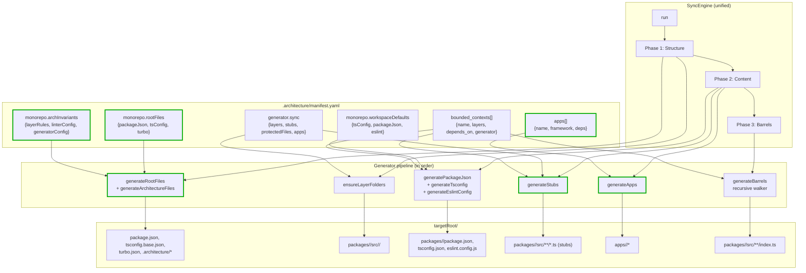

# Sync Engine Unified Scaffolding — Execution Plan

**Status:** PROPOSED
**Last Updated:** 2026-04-22
**Delivery Mode:** Option 1 — single PR, all 6 phases atomic
**Related ADRs:** ADR-0024 (sync-engine-manifest-first-compliance), ADR-0025 (to be created in Phase 6)
**Working name:** `sync-engine-unified-scaffolding`

---

## 1. Problem Statement

Today there are two implementations of "generate a HexaGen monorepo":

1. **`SyncEngine`** (`packages/sync/`) — regenerates existing monorepos from `.architecture/manifest.yaml`. Produces ~30% of what a fresh project needs: layer folders, barrels, per-package `package.json`, per-package `tsconfig.json`.

2. **`ExternalSyncEngineAdapter`** (`packages/project-generation/src/infrastructure/adapters/external-sync-engine.adapter.ts`) — called by the UI when a user exports their designed architecture. Wraps `SyncEngine` but handles the other ~70% via hardcoded templates: root files, `.architecture/` content, app scaffolding, stub TypeScript files, ESLint configs, and a duplicate fallback barrel walker.

Consequences of the split:

- **Stale barrels**: `engine.run()` fires before stubs are written; generated barrels are `export {};` and don't re-export the stubs that exist alongside them. A user who downloads a project must run `yarn sync` to fix the barrels.
- **Silent config ignore**: `monorepo.workspaceDefaults.packageJson` is ignored by `generatePackageJson` (which only reads root-level `workspaceDefaults`), so UI-declared package.json defaults never reach generated projects.
- **Template drift**: Root-file templates in `root-files.ts` (adapter) and hardcoded in the engine's `generatePackageJson`/`generateTsconfig` can diverge silently.
- **Dual feature work**: Adding a new manifest field requires parallel changes in both implementations.

## 2. Decision

Consolidate all scaffolding into `SyncEngine`. `ExternalSyncEngineAdapter` becomes a ~40 LOC shell that invokes the engine and collects the output tree.

### Canonical contract

1. **Every file in a generated project has a manifest-declared provenance.** No hardcoded templates outside the engine.
2. **Self-regen and external modes share one pipeline.** The only differences are protection semantics (self-regen preserves hand-written; external starts from zero) and which cleanup steps run (self-regen does git check + rollback; external skips).
3. **Pipeline ordering guarantees barrel correctness.** Structural work (folders, root files) → content work (package.json, tsconfig, stubs, apps, eslint) → barrel regeneration. This eliminates the stale-barrel bug.
4. **Templates live in the manifest.** New manifest sections carry the root-file, invariant, and stub templates. The generator reads them; it does not embed them.

## 3. Target Architecture



**Green nodes:** new generators, manifest sections, and outputs introduced by this plan.

## 4. Phase Contents

Each phase lists its deliverables, files touched, and verification steps. All phases commit together as a single PR.

### Phase 1 — Stub Generator + Barrel Reordering

**Delivers:** Stubs migrate from adapter into engine. Pipeline reorders so barrels see stubs. Generated projects work without post-download `yarn sync`.

**New manifest section (`generator.sync.stubs`):**

```yaml
generator:
  sync:
    stubs:
      enabled: true
      templates:
        inPort: "// in-port stub for {name}\nexport interface {name}Port {}\n"
        outPort: "// out-port stub for {name}\nexport interface {name}Port {}\n"
        adapter: "// adapter stub for {name}\nexport class {name}Adapter {}\n"
        useCase: "// use-case stub for {name}\nexport class {name}UseCase {}\n"
        entity: "// entity stub for {name}\nexport class {name} {}\n"
        valueObject: "// value-object stub for {name}\nexport type {name} = {};\n"
        domainService: "// domain service stub for {name}\nexport class {name} {}\n"
      naming:
        inPort: "{name}.in-port.ts"
        outPort: "{name}.out-port.ts"
        adapter: "{name}.adapter.ts"
        useCase: "{name}.use-case.ts"
        entity: "{name}.ts"
        valueObject: "{name}.vo.ts"
        domainService: "{name}.service.ts"
```

**Files:**

| File                                                                                      | Action                                                         |
| ----------------------------------------------------------------------------------------- | -------------------------------------------------------------- |
| `packages/sync/src/generators/stubs.ts`                                                   | NEW — generator module                                         |
| `packages/sync/src/types/manifest.ts`                                                     | ADD `StubsConfig`, `StubTemplates`, `StubNaming`               |
| `packages/sync/src/sync-engine.ts`                                                        | REORDER `generateCoreArtifacts` to insert stubs before barrels |
| `.architecture/manifest.yaml`                                                             | ADD `generator.sync.stubs` section                             |
| `packages/sync/__tests__/generators/stubs.test.ts`                                        | NEW — unit tests                                               |
| `packages/sync/__tests__/integration/idempotency.test.ts`                                 | EXTEND — assert stubs → barrels integration                    |
| `packages/project-generation/src/infrastructure/adapters/external-sync-engine.adapter.ts` | REMOVE `createStubFiles`                                       |

**Safety invariants:**

- Stub generator NEVER overwrites an existing file (regardless of `@generated` marker)
- Stub generator returns `skipped` for every file that already exists
- Integration test runs against a fixture monorepo with pre-existing stubs; asserts zero overwrites

### Phase 2 — Root Files + Architecture Files Generators

**Delivers:** Monorepo root files (`package.json`, `tsconfig.base.json`, `turbo.json`) and `.architecture/` content move from adapter into engine.

**New manifest sections:**

```yaml
monorepo:
  rootFiles:
    packageJson:
      template: |
        { "name": "{system}", ... }
    # tsConfig reuses workspaceDefaults.tsConfig
    turbo:
      template: |
        { "$schema": "...", ... }
  archInvariants:
    layerRules:
      template: |
        # layer-rules.yaml with {scope} and {template} interpolation
    linterConfig:
      template: |
        # linter-config.yaml template
    generatorConfig:
      template: |
        # generator.config.yaml template
```

**Files:**

| File                                                                                      | Action                                                                  |
| ----------------------------------------------------------------------------------------- | ----------------------------------------------------------------------- |
| `packages/sync/src/generators/root-files.ts`                                              | NEW — generator for root package.json / tsconfig.base.json / turbo.json |
| `packages/sync/src/generators/architecture-files.ts`                                      | NEW — generator for `.architecture/**`                                  |
| `packages/sync/src/template-engine.ts`                                                    | NEW — minimal `{variable}` interpolation helper                         |
| `packages/sync/src/types/manifest.ts`                                                     | ADD `RootFilesConfig`, `ArchInvariantsConfig`                           |
| `packages/sync/src/sync-engine.ts`                                                        | INSERT calls to new generators at pipeline start                        |
| `.architecture/manifest.yaml`                                                             | ADD `monorepo.rootFiles`, `monorepo.archInvariants`                     |
| `packages/sync/__tests__/generators/root-files.test.ts`                                   | NEW                                                                     |
| `packages/sync/__tests__/generators/architecture-files.test.ts`                           | NEW                                                                     |
| `packages/sync/__tests__/template-engine.test.ts`                                         | NEW                                                                     |
| `packages/project-generation/src/infrastructure/adapters/external-sync-engine.adapter.ts` | REMOVE `createRootFiles`                                                |
| `packages/project-generation/src/infrastructure/adapters/root-files.ts`                   | DELETE (content migrates to manifest + generators)                      |

**Protection rules (extend `protectedRootFiles`):**

- `.architecture/manifest.yaml` → ALWAYS protected (never overwrite even with `--force-root`)
- `package.json`, `tsconfig.base.json`, `turbo.json` → protected without `--force-root` (self-regen), created fresh (external mode on empty target)
- Invariant YAMLs have `@generated` markers to allow safe regeneration

### Phase 3 — App Scaffolding Generator

**Delivers:** `apps/<name>/*` scaffolding migrates into engine. Consumes the already-declared but unused `apps[]` manifest section.

**Manifest usage (extends existing `apps[]`):**

```yaml
apps:
  - name: web
    framework: next.js
    version: "16.x"
    depends_on: [visualization, wizard-orchestration]
  - name: api
    framework: fastify
    version: "5.x"
    depends_on: [project-generation, messaging]

generator:
  sync:
    apps:
      frameworks:
        next.js:
          packageJson:
            template: "..."
          tsConfig:
            compilerOptions: { jsx: react-jsx }
          entryPoint:
            path: src/app/page.tsx
            template: "..."
        fastify:
          packageJson:
            template: "..."
          entryPoint:
            path: src/index.ts
            template: "..."
        plain-ts:
          entryPoint:
            path: src/index.ts
            template: "..."
```

**Files:**

| File                                                                                      | Action                                                  |
| ----------------------------------------------------------------------------------------- | ------------------------------------------------------- |
| `packages/sync/src/generators/apps.ts`                                                    | NEW                                                     |
| `packages/sync/src/types/manifest.ts`                                                     | ADD `AppConfig`, `AppFrameworkConfig`                   |
| `packages/sync/src/sync-engine.ts`                                                        | INSERT call to `generateApps`                           |
| `.architecture/manifest.yaml`                                                             | POPULATE `apps[]`, ADD `generator.sync.apps.frameworks` |
| `packages/sync/__tests__/generators/apps.test.ts`                                         | NEW                                                     |
| `packages/project-generation/src/infrastructure/adapters/external-sync-engine.adapter.ts` | REMOVE `createAppFiles`                                 |
| `apps/web/app/lib/manifest-transformer.ts` (if present)                                   | UPDATE to emit `apps[]` from UI state                   |

**Notes:**

- UI's `toManifest` must now emit `apps[]` entries based on framework choices
- Bounded-context `uiFramework`/`apiFramework` fields become UI-input-only; the transformer normalizes them into `apps[]`
- Dedup rule: two bounded contexts targeting Next.js produce one `apps/web/` entry

### Phase 4 — ESLint Generator

**Delivers:** Per-package `eslint.config.js` migrates into the engine.

**New manifest section:**

```yaml
monorepo:
  workspaceDefaults:
    eslint:
      template: |
        import { config } from "@hexagen/eslint-config";
        export default config;
```

**Files:**

| File                                                                                      | Action                                                              |
| ----------------------------------------------------------------------------------------- | ------------------------------------------------------------------- |
| `packages/sync/src/generators/eslint.ts`                                                  | NEW                                                                 |
| `packages/sync/src/types/manifest.ts`                                                     | ADD `EslintConfig`; EXTEND `BoundedContextGenerator` with `eslint?` |
| `packages/sync/src/sync-engine.ts`                                                        | INSERT call to `generateEslintConfig`                               |
| `.architecture/manifest.yaml`                                                             | ADD `monorepo.workspaceDefaults.eslint`                             |
| `packages/sync/__tests__/generators/eslint.test.ts`                                       | NEW                                                                 |
| `packages/project-generation/src/infrastructure/adapters/external-sync-engine.adapter.ts` | REMOVE `createEslintConfigs`                                        |

Follows the same three-level merge cascade as `tsConfig` (Phase 2 of ADR-0024): per-context override → workspace default → built-in fallback.

### Phase 5 — Adapter Collapse + Dead Code Removal

**Delivers:** `ExternalSyncEngineAdapter` shrinks from ~375 LOC / 8 methods to ~40 LOC / 1 method. Dead code removed.

**Target adapter body (entire class):**

```ts
export class ExternalSyncEngineAdapter implements ExternalProjectGeneratorPort {
  async generateAt(
    targetRoot: string,
    manifest: Manifest,
  ): Promise<Result<Project, GeneratorError>> {
    try {
      await fs.mkdir(targetRoot, { recursive: true });

      const engine = new SyncEngine(
        {
          dryRun: false,
          force: true,
          forceRoot: true,
          allowDirty: true,
          strict: false,
          mode: "external",
          logger: noopLogger,
        },
        { targetRoot, manifest },
      );
      await engine.run();

      const files = await this.collectFileTree(targetRoot);
      const project = Project.create({
        id: generateId(),
        name: (manifest.system as string) ?? "generated-project",
        rootName: ((manifest.system as string) ?? "generated-project")
          .toLowerCase()
          .replace(/\s+/g, "-"),
        files,
      });
      return { success: true, value: project };
    } catch (err) {
      return {
        success: false,
        error: {
          code: "GENERATION_FAILED",
          message: err instanceof Error ? err.message : "Unknown error",
          cause: err,
        },
      };
    }
  }

  private async collectFileTree(
    dir: string,
    base = "",
  ): Promise<Map<string, string>> {
    // unchanged from current implementation
  }
}
```

**Deletions:**

| File/Method                                                                    | Reason                                                        |
| ------------------------------------------------------------------------------ | ------------------------------------------------------------- |
| `createRootFiles` method                                                       | Migrated to `generateRootFiles` + `generateArchitectureFiles` |
| `createAppFiles` method                                                        | Migrated to `generateApps`                                    |
| `createStubFiles` method                                                       | Migrated to `generateStubs`                                   |
| `createEslintConfigs` method                                                   | Migrated to `generateEslintConfig`                            |
| `createBarrelFiles` + `writeBarrelsRecursive` methods                          | Redundant; engine's barrel walker handles this                |
| `packages/project-generation/src/infrastructure/adapters/root-files.ts` (file) | Already deleted in Phase 2; confirm                           |

### Phase 6 — Documentation

**Delivers:** ADR-0025 documenting the unified architecture. Updates to ADR-0024 and AGENTS.md.

**Files:**

| File                                                                    | Action                                         |
| ----------------------------------------------------------------------- | ---------------------------------------------- |
| `.architecture/decisions/0025-unified-sync-engine.md`                   | NEW                                            |
| `.architecture/decisions/0024-sync-engine-manifest-first-compliance.md` | UPDATE — note mass-regen is now simpler        |
| `AGENTS.md` §7 (Invariants)                                             | ADD invariant #10: `generated-file-provenance` |
| `AGENTS.md` §8 (Testing Protocol)                                       | UPDATE — stub generation contract              |
| `docs/sync-engine-unified-scaffolding-plan.md` (this file)              | UPDATE status to COMPLETE                      |

---

## 5. Sub-Agent Delegation Plan

The orchestrator (primary agent, in 🎯 Orchestrator Mode) dispatches work across 6 waves. Each wave runs sub-agents in parallel where dependencies allow, sequentially where they don't.

### Wave dependency graph

```
Wave 1 (Foundation)          → types + template engine
  ├── 1a: manifest types     ← required by all subsequent generators
  └── 1b: template engine    ← required by Phases 2, 3, 4

Wave 2 (Generators, parallel) → all 5 new generators written
  ├── 2a: stubs generator      ← depends on Wave 1a
  ├── 2b: root-files generator ← depends on Wave 1a, 1b
  ├── 2c: arch-files generator ← depends on Wave 1a, 1b
  ├── 2d: apps generator       ← depends on Wave 1a, 1b
  └── 2e: eslint generator     ← depends on Wave 1a, 1b

Wave 3 (Engine integration)  → sync-engine.ts pipeline updates
  └── 3a: reorder + integrate ← depends on all of Wave 2

Wave 4 (Manifest + UI transformer)
  ├── 4a: populate .architecture/manifest.yaml with new sections
  └── 4b: update UI's toManifest to emit apps[] and (if needed) other sections

Wave 5 (Tests, parallel)     → per-generator unit tests + integration
  ├── 5a: stubs tests
  ├── 5b: root-files tests
  ├── 5c: arch-files tests
  ├── 5d: apps tests
  ├── 5e: eslint tests
  ├── 5f: template-engine tests
  └── 5g: extend idempotency + add E2E fixture test

Wave 6 (Adapter collapse + docs)
  ├── 6a: collapse ExternalSyncEngineAdapter
  ├── 6b: ADR-0025 + AGENTS.md updates
  └── 6c: ADR-0024 update + this plan status
```

### Wave 1 — Foundation (2 sub-agents, parallel)

**Sub-agent 1a — Manifest type extensions**

- **Scope:** `packages/sync/src/types/manifest.ts`
- **Task:** Add all type additions needed across phases in one pass:
  - `StubsConfig`, `StubTemplates`, `StubNaming`
  - `RootFilesConfig`, `ArchInvariantsConfig`
  - `AppConfig`, `AppFrameworkConfig`
  - `EslintConfig`
  - Extend `WorkspaceDefaults` with `eslint?: EslintConfig`
  - Extend `BoundedContextGenerator` with `eslint?: EslintConfig`
  - Extend `SyncConfig` (`generator.sync`) with `stubs?`, `apps?`
  - Extend `MonorepoConfig` with `rootFiles?`, `archInvariants?`
- **Verification:** `yarn workspace @hexagen/sync typecheck` passes
- **Constraint:** Types only. No generator implementation yet. No manifest YAML changes.
- **Deliverable:** Diff of `types/manifest.ts`, typecheck output

**Sub-agent 1b — Template engine helper**

- **Scope:** `packages/sync/src/template-engine.ts`
- **Task:** Minimal `{variable}` interpolation helper:
  - `interpolate(template: string, vars: Record<string, unknown>): string`
  - Handles missing variables → emit warning, leave placeholder as-is (or replace with empty string — decide and document)
  - Handles nested access? Decision: NO, keep flat variable names
  - No Mustache / Handlebars dependency
- **Verification:** `yarn workspace @hexagen/sync typecheck` passes
- **Deliverable:** File created, line count, design decisions (missing-var behavior)

### Wave 2 — Generators (5 sub-agents, parallel)

Each sub-agent produces ONE generator module following the established pattern (read manifest section → emit files via `safeWriteFileAtomic` → return `GeneratorResult`). Reference `packages/sync/src/generators/tsconfig.ts` and `packages/sync/src/generators/package-json.ts` for style.

**Sub-agent 2a — `generateStubs`**

- **Scope:** `packages/sync/src/generators/stubs.ts`
- **Task:** Read `config.manifest.generator?.sync?.stubs`. For each bounded context, for each layer declaration (entities, value_objects, ports.in, ports.out, adapters, use_cases, domain_services):
  - Compute target path using `stubs.naming` template
  - Interpolate `stubs.templates` with `{name}`
  - Write via `safeWriteFileAtomic` with `skipGeneratedCheck: false`
  - Return `GeneratorResult` with created/updated/skipped
- **Safety:** Never overwrite. Every pre-existing file → `skipped`.
- **Constraints:** No engine-pipeline integration yet (Wave 3 owns that). Just the generator module.
- **Deliverable:** Module created, exported from `packages/sync/src/generators/index.ts`, typecheck green

**Sub-agent 2b — `generateRootFiles`**

- **Scope:** `packages/sync/src/generators/root-files.ts`
- **Task:** Read `config.manifest.monorepo?.rootFiles`. Emit:
  - `${targetRoot}/package.json` (from `rootFiles.packageJson.template`)
  - `${targetRoot}/tsconfig.base.json` (reuses `workspaceDefaults.tsConfig`)
  - `${targetRoot}/turbo.json` (from `rootFiles.turbo.template`)
  - Interpolate system name, scope, package manager from manifest root
- **Protection:** All three files are in `protectedRootFiles`. Self-regen skips; external-mode-with-fresh-target creates.
- **Fallback:** If manifest section absent, use built-in template (preserves current adapter behavior)
- **Deliverable:** Module created, exported, typecheck green

**Sub-agent 2c — `generateArchitectureFiles`**

- **Scope:** `packages/sync/src/generators/architecture-files.ts`
- **Task:** Read `config.manifest.monorepo?.archInvariants`. Emit:
  - `${targetRoot}/.architecture/manifest.yaml` (external mode only — write from injected `config.manifest`; self-regen: already exists + protected)
  - `${targetRoot}/.architecture/invariants/layer-rules.yaml`
  - `${targetRoot}/.architecture/invariants/linter-config.yaml`
  - `${targetRoot}/.architecture/generator.config.yaml`
- **Fallback:** Built-in templates if manifest section absent
- **Protection:** `manifest.yaml` is ALWAYS protected (never overwrite)
- **Deliverable:** Module created, exported, typecheck green

**Sub-agent 2d — `generateApps`**

- **Scope:** `packages/sync/src/generators/apps.ts`
- **Task:** Read `config.manifest.apps` and `config.manifest.generator?.sync?.apps?.frameworks`. For each app:
  - Resolve framework-specific template from `generator.sync.apps.frameworks[<framework>]`
  - Create `${targetRoot}/apps/<name>/` + `src/`
  - Write `package.json`, `tsconfig.json`, entry-point file
  - Dedup: if two apps declare same `name`, last-wins (or warn; decide)
- **Fallback:** Built-in framework templates (next.js, fastify, plain-ts) if manifest section absent
- **Protection:** Existing app files preserved (self-regen no-op for hexagen-monaco's real apps)
- **Deliverable:** Module created, exported, typecheck green

**Sub-agent 2e — `generateEslintConfig`**

- **Scope:** `packages/sync/src/generators/eslint.ts`
- **Task:** For each bounded context:
  - Merge cascade: built-in fallback < `workspaceDefaults.eslint` < `bounded_contexts[<name>].generator.eslint`
  - Write `${targetRoot}/packages/<name>/eslint.config.js`
- **Protection:** Protect hand-written eslint configs (check for `@generated` marker)
- **Fallback:** Built-in minimal config
- **Deliverable:** Module created, exported, typecheck green

### Wave 3 — Engine Integration (1 sub-agent)

**Sub-agent 3a — Pipeline reorder**

- **Scope:** `packages/sync/src/sync-engine.ts`
- **Task:**
  - Insert `generateRootFiles` + `generateArchitectureFiles` calls at start of `run()`
  - Modify `generateCoreArtifacts()` to insert `generateStubs` BEFORE `generateBarrels`
  - Insert `generateApps` after core artifacts
  - Insert `generateEslintConfig` after core artifacts
  - Ensure all new generators feed into the structured result reporter (extend `GeneratorResults` interface)
  - Update Generator Summary log to include new categories (Stubs, Apps, Eslint, RootFiles, ArchFiles)
- **Verification:**
  - `yarn workspace @hexagen/sync typecheck` passes
  - `yarn workspace @hexagen/sync test` — pre-existing tests still pass (Wave 5 adds new tests for new generators)
- **Deliverable:** Diff of sync-engine.ts, test output

### Wave 4 — Manifest + UI Transformer (2 sub-agents, parallel)

**Sub-agent 4a — Populate `.architecture/manifest.yaml`**

- **Scope:** `.architecture/manifest.yaml`
- **Task:** Add all new sections:
  - `generator.sync.stubs` with templates + naming
  - `monorepo.rootFiles` with templates (derived from current root file content)
  - `monorepo.archInvariants` with templates
  - `apps[]` populated with hexagen's current apps (web, api, tui if applicable)
  - `generator.sync.apps.frameworks` with supported frameworks
  - `monorepo.workspaceDefaults.eslint` with current hexagen eslint config
- **CRITICAL:** Follow AGENTS.md §5.1 YAML indentation contract strictly. Run `python3 yaml.safe_load` + `yarn lint:arch` after every edit.
- **Deliverable:** Diff of manifest.yaml, YAML parse check, arch-linter output

**Sub-agent 4b — Update UI's `toManifest`**

- **Scope:** `apps/web/**/manifest-transformer.ts` (or similar; discover exact path)
- **Task:** Update UI-state → manifest transformation to emit:
  - `apps[]` entries based on wizard's framework choices (dedupe)
  - `generator.sync.stubs` (may use default from transformer)
  - Any other newly-required sections
- **Verification:** `yarn build` succeeds for the web app
- **Deliverable:** Diff of transformer, build output

### Wave 5 — Tests (7 sub-agents, parallel)

Each sub-agent writes tests for one generator OR one integration concern. Follow style from `packages/sync/__tests__/generators/tsconfig.test.ts` and `packages/sync/__tests__/integration/idempotency.test.ts`.

**Sub-agent 5a — stubs.test.ts**

- 10+ test cases: happy path, no-overwrite safety, idempotency, all element types (entity, VO, port, adapter, use-case), missing section fallback, template interpolation, per-context naming override

**Sub-agent 5b — root-files.test.ts**

- 8+ test cases: all three files created, protection semantics, fresh-target external mode, manifest-driven templates, fallback to built-ins, interpolation

**Sub-agent 5c — architecture-files.test.ts**

- 8+ test cases: invariants + generator.config written, manifest.yaml NEVER overwritten, marker-based protection for invariants, fresh-target mode, fallback

**Sub-agent 5d — apps.test.ts**

- 10+ test cases: each framework (next.js, fastify, plain-ts), dedup, missing framework → error, existing app preservation, manifest `apps[]` drives output

**Sub-agent 5e — eslint.test.ts**

- 6+ test cases: merge cascade (built-in < defaults < per-context), existing hand-written file preservation, missing section fallback

**Sub-agent 5f — template-engine.test.ts**

- 5+ test cases: basic interpolation, missing variable handling, empty template, multiple variables, nested-access rejection (if chosen as behavior)

**Sub-agent 5g — Integration + E2E**

- Extend `__tests__/integration/idempotency.test.ts`: add fixtures exercising all new generators
- NEW file: `__tests__/integration/external-scaffold.test.ts` — end-to-end test that invokes `SyncEngine` in external mode against a fixture manifest and asserts the complete generated tree matches a snapshot (file set + barrel content showing stubs re-exported)

### Wave 6 — Adapter Collapse + Documentation (3 sub-agents, parallel)

**Sub-agent 6a — Adapter collapse**

- **Scope:** `packages/project-generation/src/infrastructure/adapters/external-sync-engine.adapter.ts` + deletions
- **Task:**
  - Remove `createRootFiles`, `createAppFiles`, `createStubFiles`, `createEslintConfigs`, `createBarrelFiles`, `writeBarrelsRecursive` methods
  - Simplify `generateAt` to match target body in §4 Phase 5
  - Delete `packages/project-generation/src/infrastructure/adapters/root-files.ts`
- **Verification:**
  - `yarn workspace @hexagen/project-generation typecheck` passes
  - `yarn build` passes
  - Full sync suite still passes
  - E2E test from Wave 5g still passes
- **Deliverable:** Diff summary, verification output

**Sub-agent 6b — ADR-0025 + AGENTS.md**

- **Scope:** `.architecture/decisions/0025-unified-sync-engine.md` (new) + `AGENTS.md`
- **Task:**
  - Write ADR-0025 following house style (reference ADR-0007, ADR-0023, ADR-0024)
  - ADR content: Context (dual-implementation problem), Decision (unified engine), Consequences (positive/negative), Related ADRs
  - AGENTS.md §7: add invariant #10 `generated-file-provenance`
  - AGENTS.md §8: document stub-generation contract (never overwrites, idempotent, manifest-driven templates)
- **Deliverable:** New ADR, AGENTS.md diff

**Sub-agent 6c — ADR-0024 + plan status update**

- **Scope:** `.architecture/decisions/0024-sync-engine-manifest-first-compliance.md` + `docs/sync-engine-unified-scaffolding-plan.md`
- **Task:**
  - ADR-0024: add note that Phase 2 mass-regen is now safer because root files follow the same manifest-driven pattern
  - This plan: update status from PROPOSED to COMPLETE (when the whole PR merges)
- **Deliverable:** Diffs

---

## 6. Global Governance Block

Every sub-agent prompt must be prefixed with the standard Global Governance block per AGENTS.md §3 Orchestrator Mode §Step 4:

```
[GLOBAL GOVERNANCE — inject into every sub-agent]
- ESM NodeNext: all imports within packages/sync/ require explicit .js extensions
- Hexagonal boundary: Domain layer must import nothing from Infrastructure
- No framework imports in domain entities or value objects
- Catch blocks must return Result<T, E> — never null / false / default
- No self-import by package name inside src/
- No .d.ts files inside src/ directories
- Barrels must not be empty (no `export {}`) unless they're layer-directory stubs
- Any new @hexagen/* import requires a matching package.json dependency update
- Never run `yarn sync` or `yarn sync --force` during this work — mass regen is a
  separate human-reviewed operation (ADR-0024)
- Never mutate the host repo's working tree from a test — use temp-dir fixtures
- pre-format with prettier (`npx prettier --write <file>`) before staging to avoid
  pre-commit hook rejection
```

---

## 7. Quality Gate Checklist

Non-delegatable. The Primary runs these before declaring the PR complete:

```
Quality Gate Checklist
[ ] yarn build && yarn typecheck && yarn lint pass clean
[ ] yarn lint:arch passes — no manifest violations
[ ] No Domain package imports an Infrastructure package
[ ] No port is declared in more than one bounded context
[ ] Every catch block returns Result<T, E>
[ ] All new files correspond to a named element in manifest.yaml OR are
    tests/docs
[ ] Test doubles (if any) implement the exact same interface as the real adapter
[ ] No barrel contains only `export {}` outside layer-directory stubs
[ ] git diff --stat reviewed — no unintended reformatting
[ ] Sync test suite: 200 → target 250+ passing tests (estimate +50 across all
    new generator tests)
[ ] E2E test: ExternalSyncEngineAdapter.generateAt against fixture produces
    complete, buildable project (barrels re-export stubs, all files present)
[ ] Idempotency: yarn sync twice against self-regen = zero diff after mass regen
[ ] Host repo tripwire: no test mutates the real hexagen-monaco working tree
[ ] Mass-regen dry-run preview saved in PR description (expected diff bounded
    to ADR-0024 §Migration scope + new files for Phases 2-4)
[ ] ADR-0025 written, ADR-0024 updated, AGENTS.md §7/§8 updated
[ ] Phase 6c updates this plan's status to COMPLETE
```

---

## 8. Risk Register

| Risk                                                                                                      | Mitigation                                                                                                                                                                      |
| --------------------------------------------------------------------------------------------------------- | ------------------------------------------------------------------------------------------------------------------------------------------------------------------------------- |
| Stub generator overwrites user's hand-written code                                                        | Strict no-overwrite policy verified by test 5a's "no regression against real hexagen-monaco source" case. Generator returns `skipped` for every pre-existing file.              |
| Template-in-manifest becomes unreadable for long templates                                                | Support `template: file://.architecture/templates/<name>.tpl` loading in a follow-up. For this plan, long templates OK as YAML block scalars (use `\|`).                        |
| UI's `toManifest` doesn't emit new sections → external mode fails                                         | Every generator has a built-in fallback. If manifest section absent, fallback mirrors current adapter's hardcoded templates. UI can migrate to manifest-driven at its own pace. |
| Mass-regen discovers unexpected diffs                                                                     | Each phase's dry-run preview is captured in PR description. Any surprise surfaces for human review before mass regen.                                                           |
| Phase ordering: stubs before barrels breaks something else                                                | Integration test 5g covers the exact sequence. Unit test for stubs is standalone so stub correctness verified independently.                                                    |
| `generateApps` in self-regen mode accidentally modifies hexagen's real `apps/web/` or `apps/api-gateway/` | Strict preservation rule; never write to an existing app directory unless `--force` AND manifest marker absent. Test 5d includes this case.                                     |
| Template interpolation silently produces garbage on missing variables                                     | `template-engine.ts` design decision: log warning, leave placeholder visible (makes mistakes obvious). Tested in 5f.                                                            |
| PR becomes too large for reviewer                                                                         | Use the commit-per-wave pattern within the single PR (each wave = 1 commit). Reviewer can review wave-by-wave.                                                                  |

---

## 9. Verification at Each Stage

The orchestrator verifies after EACH wave before dispatching the next:

**After Wave 1 (Foundation):**

- `yarn workspace @hexagen/sync typecheck` ✓
- `yarn workspace @hexagen/sync build` ✓
- Git status: only types + template-engine files modified

**After Wave 2 (Generators):**

- `yarn workspace @hexagen/sync typecheck` ✓
- `yarn workspace @hexagen/sync build` ✓
- 5 new generator modules exist and are exported from barrel
- No tests yet (Wave 5)

**After Wave 3 (Engine integration):**

- `yarn workspace @hexagen/sync typecheck` ✓
- `yarn workspace @hexagen/sync build` ✓
- Existing sync tests still pass (no behavior change — new generators only fire on manifest sections that don't exist yet)

**After Wave 4 (Manifest + UI):**

- `yarn lint:arch` ✓
- `yarn build` (full monorepo) ✓ — UI still compiles
- Dry-run sync: `node packages/sync/dist/cli.js sync --dry-run --allow-dirty` — preview expected diff
- Host repo git status unchanged (only planned files modified)

**After Wave 5 (Tests):**

- `cd packages/sync && npx tsx --test $(find __tests__ -name "*.test.ts") 2>&1 | tail -10` — expect 200+ passing, 0 failing
- `yarn typecheck`, `yarn build`, `yarn lint:arch` all ✓

**After Wave 6 (Adapter collapse + docs):**

- Full monorepo build + typecheck + lint:arch ✓
- E2E test from Wave 5g passes
- Final PR ready for review

---

## 10. Effort Estimate

Rough time estimates (ideal-hour sub-agent work):

| Wave                        | Sub-agents | Hours (parallel)                        |
| --------------------------- | ---------- | --------------------------------------- |
| 1 — Foundation              | 2          | 1-2                                     |
| 2 — Generators              | 5 parallel | 3-4 (bottleneck = slowest single agent) |
| 3 — Engine integration      | 1          | 2-3                                     |
| 4 — Manifest + UI           | 2          | 2-3                                     |
| 5 — Tests                   | 7 parallel | 3-4                                     |
| 6 — Adapter collapse + docs | 3 parallel | 2-3                                     |
| Verification + Quality Gate | Primary    | 2                                       |
| **Total (parallelized)**    | —          | **15-21 hours**                         |

Sequential total would be 30+ hours; parallelization saves ~40%.

LOC impact:

- ~+530 engine source (5 generators + template engine + types)
- ~–470 adapter source (5 methods removed + root-files.ts deleted)
- ~+1150 tests across 7 test files
- ~+300 markdown (ADR-0025 + AGENTS.md + this file's updates)

Net: +510 source, +1150 tests, +300 docs. The code base grows but complexity per module drops: one engine, one generator per concern, no duplicate implementations.

---

## 11. Success Criteria

The plan is COMPLETE when:

1. ✅ All 6 phases' deliverables landed in a single atomic PR
2. ✅ Quality Gate checklist (§7) passes unconditionally
3. ✅ Sync test suite: 250+ passing (up from 200)
4. ✅ `ExternalSyncEngineAdapter` is ≤ 50 LOC
5. ✅ `packages/project-generation/src/infrastructure/adapters/root-files.ts` does not exist
6. ✅ Every file in a generated project (from UI) is produced by a SyncEngine generator — no adapter-side template remains
7. ✅ Generated projects pass `yarn build` immediately after extraction (no need to run `yarn sync` first) — barrels correctly re-export stubs
8. ✅ ADR-0025 published and referenced from ADR-0024
9. ✅ This plan's status updated to COMPLETE

---

**Ready to move to Develop mode when you say `develop sync-engine-unified-scaffolding`.**
